# From Eq. (6) to Eq. (7): the EPR zero-point-fluctuation identity

**Source:** Section II.A (transmon coupled to a cavity) of
[Minev et al., arXiv:2010.00620](https://arxiv.org/abs/2010.00620).

> Equations are pre-rendered to images because Warp's markdown viewer has no math engine.
> Inline symbols use Unicode (φ, ω, ħ, â, n).

---

## What the two equations are

**Eq. (6)** — the *quantum* definition of the participation ratio: the fraction of **inductive**
energy stored in the junction when only mode m is excited (state |ψ_m⟩ = Fock/coherent
excitation of mode m), with **normal ordering**:

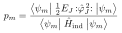

**Eq. (7)** — the result we want to reach:

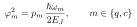

The goal is to show four facts collapse Eq. (6) into Eq. (7).

---

## Step 1 — Junction flux in the mode basis

The junction reduced flux is linear in the mode operators; isolating the single excited mode m,
and writing its linear inductive energy (L_J = φ₀²/E_J ⇒ Φ_J²/2L_J = ½E_J φ̂_J²):

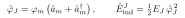

Here **φ_m ≡ φ_mJ is exactly the zero-point fluctuation amplitude we are solving for.**

---

## Step 2 — Numerator: junction energy, normal-ordered

Normal ordering gives ⟨n| :(â+â†)²: |n⟩ = 2n (no vacuum +1):

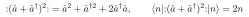

so the junction's inductive-energy expectation is

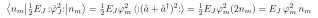

---

## Step 3 — Denominator: equipartition

A harmonic mode splits its energy equally between inductive (magnetic) and capacitive (electric)
parts, ⟨Φ̂²/2L⟩ = ⟨Q̂²/2C⟩. The normal-ordered total energy of mode m is ħω_m·n_m, so the
**total inductive** energy is half of that:

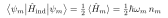

---

## Step 4 — Take the ratio (the n_m cancels)

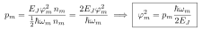

The excitation number n_m cancels — the participation is **intensive**, as a "fraction of energy"
must be. Inverting gives Eq. (7).

---

## Reminder: what is normal ordering?

**Normal ordering**, written `:Ô:`, reorders a product of ladder operators so that **all creation
operators ↠sit to the left of all annihilation operators â** — reshuffling them *as if they
commuted* (i.e. ignoring [â,â†]=1 during the move). Concretely:

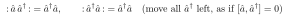

The point is the dropped commutator. For the square that appears in our derivation:

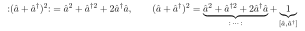

So `:(â+â†)²:` is exactly the ordinary `(â+â†)²` **minus the vacuum term** that the commutator
[â,â†]=1 produces. That "+1" is the zero-point fluctuation; normal ordering throws it away.

Two ways to see what it does:

- **Fock state:** ⟨n| :(â+â†)²: |n⟩ = 2n, versus ⟨n|(â+â†)²|n⟩ = 2n **+ 1**.
- **Coherent state:** taking the expectation of a normal-ordered operator is the same as the
  **classical replacement** â → α, ↠→ α*:

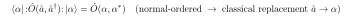

This last property is the deep reason the EPR method uses it: normal ordering is the bridge that
makes the *quantum* junction-energy expectation reduce to the *classical* field energy that the
finite-element solver computes — with the divergent vacuum piece removed.

---

## Is normal ordering an approximation? (No — it's exact)

A natural worry: by reshuffling operators "as if they commuted," are we ignoring [â,â†]=1 and
making an approximation? **No.** Three reasons.

**(1) It's a definition, not an approximation.** `:Ô:` is a *new operator*, equal to Ô plus a
known c-number — the commutator term is **separated out, not deleted**:

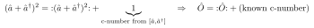

We are only choosing *which* operator to call "the junction energy." Nothing is approximated.

**(2) For the real Josephson cosine, normal ordering is an exact rewriting.** With
φ̂ = φ_zpf(â+â†), the exact BCH identity (valid because [â,â†] is a c-number) gives

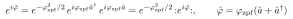

and therefore, with **no truncation**:

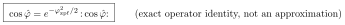

The commutator is not ignored — it *generates* the prefactor e^(−φ_zpf²/2) < 1, which is the
real, vacuum-fluctuation reduction of the effective Josephson energy (a Debye–Waller-like factor).
It's a re-summation, not a dropped term.

**(3) What we drop is unobservable; observable vacuum physics is kept.** The set-aside piece (the
+1, the e^(−φ_zpf²/2) baseline) is the **zero-point** contribution. Excluding it from the
*participation ratio* is legitimate because it (a) is an additive constant → no dynamics, (b)
**cancels** in every measurable energy *difference*, and (c) would **diverge** if summed over all
modes. Meanwhile the *nontrivial* vacuum effects are retained — the **Lamb shift** Δ_m in
Ĥ_full (ω_m′ = ω_m − Δ_m) is itself a zero-point effect and is kept.

> **Bottom line:** normal ordering is an exact operator identity. The commutator is accounted for —
> as the explicit c-number we subtract, or (for the cosine) as the exact E_J renormalization
> e^(−φ_zpf²/2). This is also why EPR predictions match experiment to a few percent: no real
> physics is thrown away.

---

## Why normal ordering is essential (the crux)

Without `: :`, one has ⟨n|(â+â†)²|n⟩ = 2n **+ 1**. The extra +1 is the vacuum contribution, and it
would:

1. make p_m depend on the excitation level n_m (so it's no longer a clean "fraction"), and
2. sum to a **divergent** zero-point energy over infinitely many modes.

Normal ordering subtracts the vacuum, leaving the participation of the *excitation* — an intensive,
n_m-independent number. (Paper: Supplementary Section A6.)

---

## One-line physical reading

Of the **½ħω_m** of inductive energy carried by *one added photon* in mode m, the fraction **p_m**
lives in the junction. That junction share equals **E_J φ_m²**, which rearranges directly to

> **φ_m² = p_m · ħω_m / (2 E_J).**

This is the bridge from the *classical* eigenmode solve (which gives p_m) to the *quantum*
zero-point fluctuations φ_m that set every nonlinear coupling. The general multi-junction version
is Eq. (21).
