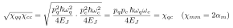

# Do Eq. (11) and Eq. (12) contradict each other?

**No** — Eq. (12) is Eq. (11) re-expressed via Eqs. (9)–(10). They are the same number.

The relevant equations (Section II.A):

- Eq. (9):  α_q = ½ χ_qq = p_q² ħω_q² / (8 E_J)
- Eq. (10): α_c = ½ χ_cc = p_c² ħω_c² / (8 E_J)
- Eq. (11): χ_qc = p_q p_c ħ ω_q ω_c / (4 E_J)
- Eq. (12): χ_qc = √(χ_qq χ_cc) = 2√(α_q α_c)

## One-line consistency check

Using χ_mm = 2α_m:

So (11) and (12) are identical.

## Why it *looks* like it might overconstrain

For a **single junction** shared by both modes, the EPR "vector" is rank-1, so the cross-Kerr
**saturates** the Cauchy–Schwarz bound — equality, hence χ_qc = √(χ_qq χ_cc) *exactly*.

With **multiple junctions**, the cross-Kerr becomes a scalar product of EPR vectors (general
**Eq. (26)–(28)**), and only the inequality χ_mn ≤ √(χ_mm χ_nn) holds.

## Read in the paper

- Derivation: **Supplementary Section B**.
- General matrix / scalar-product form: **Eqs. (26)–(28)**.
- The text between Eq. (11) and (13) explicitly notes χ_qc and α_q are *interdependent* (a single
  EPR p_m fixes each mode's nonlinearity) — i.e. by design, not contradiction.
