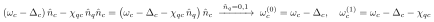
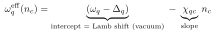
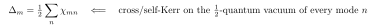
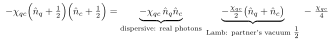
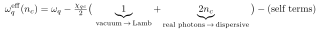

# How to see χ_qc is the dispersive shift, from Eq. (8)

Eq. (8):

> Ĥ_eff = (ω_q − Δ_q) n̂_q + (ω_c − Δ_c) n̂_c − χ_qc n̂_q n̂_c
>         − ½ α_q n̂_q(n̂_q − 1) − ½ α_c n̂_c(n̂_c − 1)

**Trick:** group the cross-Kerr term −χ_qc n̂_q n̂_c with the cavity number operator.

The cavity's effective frequency becomes ω_c − Δ_c − χ_qc·n̂_q — i.e. it is pulled by **−χ_qc per
qubit excitation**:

- qubit in |0⟩  →  cavity at ω_c − Δ_c
- qubit in |1⟩  →  cavity at ω_c − Δ_c − χ_qc

That qubit-state-dependent cavity frequency **is** the dispersive shift — the basis of dispersive
readout. By symmetry of the n̂_q n̂_c term, the qubit frequency likewise shifts by −χ_qc per cavity
photon (the AC-Stark / number-splitting view).

## Read in the paper

The sentence introducing Eq. (8) already names χ_qc the "qubit–cavity dispersive shift (cross-Kerr
coupling)." The grouping above is just how the n̂_q n̂_c term realizes that label.

---

## Lamb shift vs. dispersive shift (don't confuse Δ_q and χ_qc)

Both appear in Eq. (8). The clean distinction is **offset vs. slope** in the *partner* mode's
photon number. The qubit 0→1 transition at fixed cavity occupation n_c (from Eq. 8; the α_q term
drops out for the 0→1 transition) is:

| | **Lamb shift Δ_q** | **Dispersive shift χ_qc** |
|---|---|---|
| What | vacuum renormalization of the frequency | state-dependent pull per partner excitation |
| In Eq. (8) | shifts ω_q → ω_q − Δ_q | the n̂_q n̂_c cross-Kerr term |
| Photon dependence | **none** (present even at n_c = 0) | **linear in n_c** (slope) |
| Origin | zero-point fluctuations dressing the nonlinearity | real excitations in the other mode |
| Observable | absolute dressed frequency | qubit-state ↔ cavity-freq correlation (readout) |

They are two faces of the *same* nonlinearity. In fact the Lamb shift is built from the
cross/self-Kerr acting on the half-quantum of vacuum in every mode:

i.e. each mode n contributes ½χ_mn from its zero-point half-photon — that is *why* the vacuum
(n_c = 0) frequency is already shifted.

**Read in the paper:** the text right after Eq. (8) ("Δ… due to the dressing of this nonlinear mode
by quantum fluctuations of the fields"); the experimental relation Δ_q = α_q − χ_qc/2; and the
general Δ_m = ½ Σ_n χ_mn below Eq. (25)–(26).

---

## Aren't *both* shifts due to vacuum fluctuations?

Tempting, but **no — only the Lamb shift is a vacuum effect.** They are the *same* cross-Kerr
interaction, evaluated on different things. Write it symmetrically (since (â+â†)² → 2n̂+1):

Equivalently, the qubit frequency is pulled by ½χ_qc·(2n_c + 1):

- the **"1"** is the cavity's zero-point half-quantum → **Lamb shift** (survives at n_c = 0);
- the **"2n_c"** is **real photons** → **dispersive / AC-Stark shift** (zero if the cavity is empty).

So:

- **Lamb shift** — yes, genuinely vacuum: the qubit dressed by the *zero-point* fluctuations of the
  cavity (and itself). It is the cross/self-Kerr acting on the ½'s, which is exactly why
  Δ_m = ½ Σ_n χ_mn.
- **Dispersive shift** — **not** vacuum. It is the response to *real* excitations n_c. Empty cavity
  ⇒ no dispersive shift, only the Lamb shift.

**The grain of truth:** the *coefficient* χ_qc is itself set by the zero-point fluctuation
*amplitudes* φ_q, φ_c (χ_qc = ħω_qω_c p_q p_c / 4E_J, and φ_m² ∝ ZPF). So vacuum sets the *strength*
of the knob; real photons are what *turn* it. Strength (vacuum) vs. drive (real photons) — that's
the clean split.
