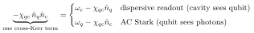
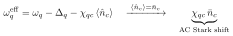

# Does the AC Stark effect exist in Eq. (8)?

**Reframe:** the AC Stark *mechanism* IS in Eq. (8) — it's literally the cross-Kerr term $-\chi_{qc} \hat n_q \hat n_c$. **AC Stark shift = dispersive shift = the same term**, named by which mode you call the "field":

- **Dispersive (readout):** cavity frequency depends on qubit state, $\omega_c - \chi_{qc} \hat n_q$.
- **AC Stark:** qubit frequency depends on cavity photon number, $\omega_q - \chi_{qc} \hat n_c$.

The qubit frequency with a populated cavity:

## What you're right about

Eq. (8) has **no drive term** (no $\hat a + \hat a^\dagger$ linear-in-field piece) — it is the bare, undriven Hamiltonian. Nothing *imposes* a cavity population, so with the cavity in vacuum ($\bar n_c = 0$) there is no Stark shift, only the **Lamb shift** (the "1" in the $2n_c + 1$ split — see doc 05).

## What would be wrong

To say the effect *can't occur* here. The susceptibility $\chi_{qc}$ — the shift per photon — is fully present in Eq. (8). Add a drive, or prepare a coherent cavity state with $\bar n_c$ photons, and the qubit shifts by $\chi_{qc}\cdot\bar n_c$. **Eq. (8) supplies the susceptibility; the drive supplies the photons.**

## Summary

| | mechanism ($\chi_{qc} \hat n_q \hat n_c$) | drive ($\hat a + \hat a^\dagger$) | net shift |
|---|---|---|---|
| In Eq. (8)? | **yes** | **no** | only Lamb shift until cavity is populated |
| AC Stark | this term | needed to set $\bar n_c$ | $\chi_{qc} \bar n_c$ |
| Dispersive readout | this term | not needed (qubit state, not drive) | $\chi_{qc}$ per qubit excitation |

So AC Stark is "absent" only in the sense that no drive is written to activate it; the coupling that produces it is the cross-Kerr term already in Eq. (8).

---

## Are the dispersive shift and the AC Stark shift the same effect?

**Yes** — same single term $-\chi_{qc} \hat n_q \hat n_c$, two readings depending on which operator you hold fixed. Because $\hat n_q \hat n_c$ is symmetric, neither mode is privileged:

> $\partial\omega_c/\partial n_q = \partial\omega_q/\partial n_c = -\chi_{qc}$.

- **Dispersive shift** (resonator view): fix qubit state $\to$ cavity at $\omega_c - \chi_{qc} \hat n_q$. Driven by the qubit's *own state*; no extra drive needed. Used for **readout**.
- **AC Stark shift** (qubit view): fix cavity photons $\to$ qubit at $\omega_q - \chi_{qc} \hat n_c$. Needs *real cavity photons* (drive or thermal). Used for **spectroscopy / photon-number calibration**.

Two caveats so "same effect" doesn't over-merge them:

1. **What acts as "the field" differs.** Dispersive readout uses the qubit state; AC Stark needs real photons in the cavity. (This is why Eq. (8) has the coupling but no drive — see above.)
2. **Photon-number splitting** is the same coupling in the resolved limit $\chi_{qc} > \kappa$ (cavity linewidth): the qubit line splits into discrete peaks at $\omega_q - \chi_{qc}\cdot n_c$, one per Fock state — the AC Stark shift "quantized." Still the same $\chi_{qc}$.

**One coupling, one number $\chi_{qc}$ — dispersive shift, AC Stark shift, and photon-number splitting are its different experimental faces.**
