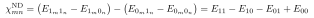
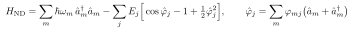
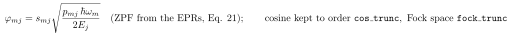
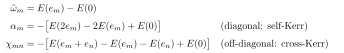

# Does $\chi_\text{ND}$ assume Eq. (8)? (No — the premise is backwards)

In **pyEPR** there are two cross-Kerr outputs:

- **`chi_O1`** — first-order **perturbation theory**; this is the one tied to **Eq. (8)/(26)**, the analytic EPR formula $\chi_{mn} = \hbar \omega_m \omega_n p_{mj} p_{nj} / 4E_J$.
- **`chi_ND`** — from **Numerical Diagonalization**; the *non*-perturbative one.

So **$\chi_\text{ND}$ does NOT assume Eq. (8).** It diagonalizes the full cosine Hamiltonian (Eq. 17, $\hat H_\text{lin} + \hat H_\text{nl}$, truncated by `cos_trunc`/`fock_trunc`) and reads $\chi$ off the *exact* eigenenergies as a mixed finite difference:

i.e. "how much mode $m$'s transition moves when mode $n$ gains one excitation" — straight from the spectrum, no Eq. (8) invoked.

## Your conclusion inverts

If perturbation theory starts to break (stronger coupling/nonlinearity), **$\chi_\text{ND}$ is the one to trust *more***, not less — that's *why* pyEPR computes it. The **divergence between `chi_O1` and `chi_ND`** is the standard diagnostic that you're leaving the perturbative regime.

## But $\chi_\text{ND}$ has its *own* validity limits (unrelated to Eq. 8)

1. **Truncation convergence** — only as good as `cos_trunc` and `fock_trunc`. Strong nonlinearity needs larger truncation; check convergence.
2. **Eigenstate labeling** — extracting $E_{11}$, $E_{10}$, … requires assigning each eigenstate a label $(n_m, n_n)$ by max overlap with bare product-Fock states. Near resonance / strong hybridization / avoided crossings this assignment is **ambiguous**, so $\chi_\text{ND}$ becomes ill-defined as "the dispersive shift" regardless of numerical accuracy.
3. **The concept itself** — outside the dispersive regime "the dispersive shift" is not a single number: the per-photon shift goes nonlinear (higher Kerr terms), so no scalar $\chi$ describes the spectrum. Report eigenenergies, not a $\chi$.
4. **EPR's own footing** — assumes the junction is a manageable perturbation on the linear modes and that *all relevant modes* are included ("best suited for weakly anharmonic systems").

## Summary

| | tied to Eq. (8)? | breaks when PT breaks? | own failure modes |
|---|---|---|---|
| `chi_O1` (perturbative) | **yes** (Eq. 8/26) | **yes** | — |
| `chi_ND` (numerical) | **no** | **no** (designed to survive it) | truncation, label ambiguity, dispersive concept itself |

**Read in the paper:** the sentence introducing Eq. (8) ("if $\hat H_\text{nl}$ is a perturbation to $\hat H_\text{lin}$… can be approximated by") marks Eq. (8) as the perturbative branch; the remark that $\hat H_\text{full}$ "can be done approximately or exactly using numerical or analytical techniques [20]" is the $\chi_\text{ND}$ branch.

---

## Then what Hamiltonian *does* $\chi_\text{ND}$ assume, and how is the matrix defined?

$\chi_\text{ND}$ works from the **parent Hamiltonian that Eq. (8) is derived from** — the full EPR Hamiltonian, Eqs. (17)+(19). For tunnel junctions:

**Key distinction.** Eq. (8) = (i) Taylor-expand this cosine to 4th order **and** (ii) keep only excitation-number-conserving terms, perturbatively. $\chi_\text{ND}$ does **neither** reduction: it keeps the full (truncated) cosine — *including* non-number-conserving terms ($\hat a^{\dagger 3}\hat a$, three-wave, …) — and **diagonalizes it numerically**. The *form* of Eq. (8) is not assumed; only the same parent operator.

**How the matrix terms are defined.** Diagonalize $H_\text{ND}$, label each eigenstate by the bare occupation vector $\vec n$ it most overlaps, giving dressed energies $E(\vec n)$. Here $e_m$ is the **occupation vector with one quantum in mode $m$** (the $m$-th unit vector — a state label, not an operator):

The reported quantities are then pure **spectral finite differences**:

These are just "minus the discrete second derivative of the spectrum" — the operational definition of anharmonicity (diagonal) and cross-Kerr (off-diagonal). They are built so that **if** the spectrum is Kerr-like they equal Eq. (8)'s $\alpha_m$, $\chi_{mn}$, but are computed from the exact levels regardless.

**Logic:** $\chi_\text{ND}$ assumes the *same Hamiltonian* as Eq. (8), but not its *functional form* — it measures the same energy-difference observables on the numerically exact spectrum. This is also why the max-overlap **labeling** step is the soft spot: the definitions above only make sense while eigenstates can still be tagged by $\vec n$.

**Read in the paper:** $H_\text{lin}$ = Eq. (16/17); the cosine $\hat H_\text{nl}$ with $c_{jp}$ coefficients = Eq. (17) + expansion (19); $\varphi_{mj}$ = Eq. (21).
