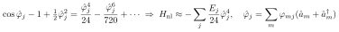
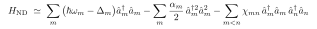
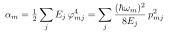
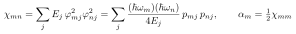
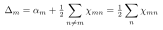
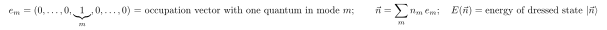
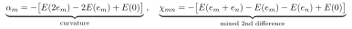
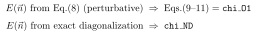

# Writing $H_\text{ND}$ with $\alpha_m$ and $\chi_{mn}$ (the Kerr form)

Starting Hamiltonian (full cosine; see [07](07-chi-ND-vs-perturbation.md)):

> $H_\text{ND} = \sum_m \hbar\omega_m \hat a_m^\dagger\hat a_m - \sum_j E_j [\cos \hat\varphi_j - 1 + \tfrac12 \hat\varphi_j^2]$

**You cannot write $H_\text{ND}$ *exactly* with only $\alpha_m$ and $\chi_{mn}$** — those capture only the leading quartic, number-conserving part. That leading reduction is the Kerr Hamiltonian (= Eq. 25).

## Reduction

Expand the cosine and substitute $\hat\varphi_j = \sum_m \varphi_{mj}(\hat a_m + \hat a_m^\dagger)$:

Normal-order and keep the number-conserving monomials ($\hat a_m^{\dagger 2}\hat a_m^2$ and $\hat a_m^\dagger\hat a_m \hat a_n^\dagger\hat a_n$):

with

(Combinatorics: $\hat a^{\dagger 2}\hat a^2$ enters $\hat\varphi^4$ with weight 6 $\to$ $\alpha_m$; the mixed $\hat n_m \hat n_n$ term with weight $6\times4 = 24$ $\to$ $\chi_{mn}$; the leftover $\hat a^\dagger\hat a$ pieces give the Lamb shift $\Delta_m$. Note $\alpha_m = \tfrac12 \chi_{mm}$.)

In EPRs: $\varphi_{mj}^2 = p_{mj} \hbar\omega_m / (2E_j)$, which is what turns the $\varphi$-forms into the $p$-forms above (matching Eq. 26 for $\chi$ and Eq. 9/10 for $\alpha$).

## Why "$\simeq$", not "$=$"

Writing $H_\text{ND}$ with only $\alpha_m$, $\chi_{mn}$ discards:

1. **higher-order Kerr** — the $\hat\varphi^6$ term $\to$ $\hat a^{\dagger 3}\hat a^3$, etc.;
2. **non-number-conserving / counter-rotating** terms — kept in $H_\text{ND}$, dropped here.

This $\alpha,\chi$ form **is** the perturbative `chi_O1` Hamiltonian. `chi_ND` diagonalizes the full $H_\text{ND}$ *before* this reduction — exactly the `chi_O1` vs `chi_ND` distinction (see [07](07-chi-ND-vs-perturbation.md)).

## Read in the paper

The boxed Hamiltonian is **Eq. (25)**; $\chi_{mn}$ is **Eq. (26)**; $\alpha_m$ is **Eq. (9/10)**; $\Delta_m = \tfrac12 \sum_n \chi_{mn}$ is stated below Eq. (25). It is the leading-order face of $H_\text{ND}$, i.e. of Eq. (17).

---

## Are $\alpha_m$, $\chi_{mn}$ "redefined" between Eq. (9–11) and $\chi_\text{ND}$?

No — there is **one definition**, evaluated on **two spectra**. The invariant, physical definition is *spectral*: anharmonicity = curvature of the ladder; cross-Kerr = mixed second difference of the energies $E(\vec n)$. Here $e_m$ = occupation vector with one quantum in mode $m$ ($m$-th unit vector, a state label):

Feed it two different spectra:

- **Perturbative spectrum** (eigenvalues of the Eq.-8 Kerr Hamiltonian) $\to$ recovers exactly the Eq. (9–11) formulas $\to$ `chi_O1`.
- **Exact spectrum** (numerical diagonalization of full $H_\text{ND}$) $\to$ `chi_ND`.

Same finite-difference operation, different input energies. So $\alpha_m$, $\chi_{mn}$ are the **same observable**, not a redefinition: Eqs. (9–11) are its leading-order analytic value, `chi_ND` its exact numerical value. They agree in the weakly-nonlinear limit and diverge when higher-order terms make the true spectrum non-Kerr.

**The subtlety you sensed:** because the exact spectrum is *not* perfectly Kerr, the finite-difference $\alpha_m$, $\chi_{mn}$ depend on *which* levels you pick (by convention the bottom, 0,1,2). The per-photon shift at high $n$ differs from $\chi_{mn}$ extracted at $0\to1$; capturing that needs *extra* parameters (6th-order Kerr, …). That residual is exactly why $H_\text{ND}$ can't be written with $\alpha_m$, $\chi_{mn}$ alone — they are the **leading spectral coefficients**, not exact Hamiltonian parameters.

> One definition, two evaluations. `chi_ND` is the faithful value of the same $\alpha_m$, $\chi_{mn}$; Eqs. (9–11) are its first-order approximation. pyEPR reports both because they are the same quantity computed two ways — and their gap is the breakdown gauge.

## Provenance: which definition is actually in the paper?

Important caveat on the two "definitions" above:

- **Perturbative / formula definition — IN the paper.** $\alpha_m$, $\chi_{mn}$ are defined as the coefficients of the effective excitation-number-conserving Hamiltonian: **Eq. (25)** + the sentence right after it (general), and **Eq. (8)** (simple example). Their values are **Eq. (26)** (with $\alpha_m = \chi_{mm}/2$, $\Delta_m = \tfrac12 \sum_n \chi_{mn}$) and **Eqs. (9)–(12)** (example). Derivation: **Supplementary Section B**.

- **Spectral finite-difference definition ($E_{11} - E_{10} - E_{01} + E_{00}$) — NOT in the paper.** The paper only states $H_\text{full}$ "can be analytically or numerically diagonalized using various computational techniques [20]" and that pyEPR [95] extracts "its quantum spectrum," without writing the extraction formula. The explicit finite-difference recipe is **pyEPR's implementation convention** (and standard cQED practice from the black-box-quantization lineage, e.g. Nigg et al. 2012 = paper ref [4]).

So the "one definition, two spectra" framing is the *conceptually* unifying view, but only the perturbative branch is written in the paper; the spectral branch lives in pyEPR.
