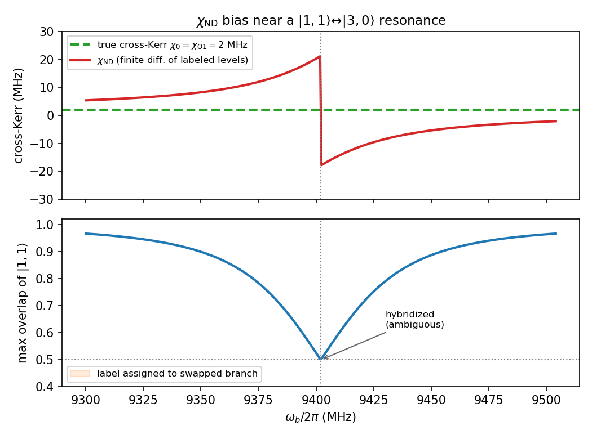
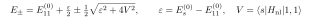
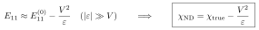

# The labeling issue in $\chi_{\rm ND}$, and why it biases dispersive-shift estimates

See [07](07-chi-ND-vs-perturbation.md)/[08](08-H_ND-in-kerr-form.md) for what $\chi_{\rm ND}$ is. Here: how the **eigenstate labeling** step works, a worked example where it fails, and why the failure is a *systematic* bias.

## How labeling works

Diagonalizing $\hat H_{\rm ND}$ gives *dressed* eigenstates $|\psi_k\rangle$. The finite-difference formulas need to know which $|\psi_k\rangle$ "is" $|1,1\rangle$, $|1,0\rangle$, etc. Standard rule (pyEPR): assign bare label $(n_a, n_b)$ to the eigenstate of **largest overlap** $|\langle n_a,n_b|\psi_k\rangle|^2$.

- **Weak nonlinearity:** each dressed state $\approx$ 99% one bare state $\to$ unambiguous $\to$ $\chi_{\rm ND} \approx \chi_{\rm O1}$. Fine.
- **Strong hybridization:** overlaps drop toward 0.5 $\to$ assignment becomes ambiguous $\to$ trouble.

## Worked example

Two modes: true cross-Kerr $\chi_0 = 2$ MHz, plus a cubic term $g(\hat a^{\dagger 2}\hat b + \hat a^2\hat b^\dagger)$ — a non-number-conserving piece that lives in the full cosine but is *dropped* in the Kerr/`chi_O1` reduction. It couples $|1,1\rangle \leftrightarrow |3,0\rangle$, resonant when $\omega_b \approx 2\omega_a - 3\alpha_a$ (here $\approx 9402$ MHz). Sweeping $\omega_b$:

| $\omega_b$ (MHz) | $\chi_{\rm ND}$ (MHz) | overlap of $\vert 1,1\rangle$ | eigenstate k(1,1) | k(3,0) |
|---|---|---|---|---|
| 9300 | 5.4 | 0.967 | 4 | 5 |
| 9395 | 18.1 | 0.588 | 4 | 5 |
| 9402 | 21.3 | 0.500 | 4 | 5 |
| 9410 | −14.3 | 0.600 | **5** | **4** |
| 9500 | −2.2 | 0.964 | 5 | 4 |

True value is **2 MHz throughout**, yet $\chi_{\rm ND}$ swings from +21 to −14, and the eigenstate index for $|1,1\rangle$ **swaps** (4 $\leftrightarrow$ 5) across the crossing.

## The $2\times2$ model

Bare $|1,1\rangle$ vs spectator $|s\rangle = |3,0\rangle$, detuning $\varepsilon$, coupling $V = \langle s|\hat H_{\rm nl}|1,1\rangle = g\sqrt6$:

Only $E_{11}$ sits near the resonance ($E_{00}$, $E_{10}$, $E_{01}$ do not), so the finite difference inherits the repulsion directly:

## Why it's a *systematic* bias (not noise)

1. **Sign-definite.** Repulsion always pushes labeled $|1,1\rangle$ *away* from the spectator: $-V^2/\varepsilon$ has a fixed sign on each side of the resonance. Sweeping $E_J$/geometry/photon number varies it smoothly but one-sidedly — it does not average out.
2. **Contaminates only $E_{11}$.** Just one of the four levels is near resonance, so the shift enters $\chi_{\rm ND}$ undiluted.
3. **Label swap at the crossing.** At $\varepsilon = 0$ the eigenstates are 50/50; max-overlap is a tie and picks a branch arbitrarily. For $\varepsilon<0$ vs $\varepsilon>0$ the "mostly-$|1,1\rangle$" eigenstate is a *different index* (k: 4 $\leftrightarrow$ 5 above). A mislabel grabs the wrong level $\to$ discontinuous jump / sign flip in $\chi_{\rm ND}$.

## Why it matters physically

This is not a dismissable artifact — it *is* the real breakdown of the dispersive picture (measurement-induced state transitions; $\chi$ going photon-number-dependent). The genuine cross-Kerr is conflated with an accidental resonance against a **non-readout** state. $\chi_{\rm ND}$ returns a correct level difference, but a **biased estimate of the dispersive shift**.

Contrast:
- `chi_O1` stays flat at 2 MHz (it dropped the cubic term) $\to$ **misses** the real repulsion.
- `chi_ND` $\to$ **over-attributes** the repulsion to dispersion.

Near such resonances neither equals "the dispersive shift"; you must identify the resonance.

**Practical tell:** if the max overlap of the labeled state isn't $\approx 1$, distrust $\chi_{\rm ND}$. Check `fock_trunc` convergence and look for a nearby bare state it's colliding with.
