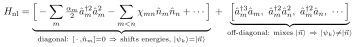
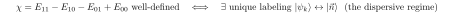

# Why |ψ_k⟩ ≠ bare basis, is it a truncation artifact, and is χ ill-defined?

Follow-up to [09](09-chi-ND-labeling-bias.md). Three questions, taken in order.

## 1. Why is |ψ_k⟩ different from the bare basis?

Bare basis = eigenstates of the *linear* part H_lin = Σ_m ħω_m â_m†â_m, i.e. product Fock states
|n⃗⟩. They diagonalize H_lin but not H_ND = H_lin + H_nl. Split H_nl by how it acts in the bare
basis:

- **Diagonal (number-conserving) part** — all the Kerr / cross-Kerr terms — commutes with every n̂_m.
  It leaves Fock states as **exact eigenstates** and only shifts their energies. *If H_nl had only
  these, |ψ_k⟩ = |n⃗⟩ exactly and χ_ND = χ_O1, with no labeling issue.*
- |ψ_k⟩ ≠ |n⃗⟩ comes **entirely from the off-diagonal, non-number-conserving terms** (counter-rotating
  pieces of the cosine). They connect different Fock states → eigenstates are superpositions →
  hybridization, avoided crossings, label swaps.

(Higher *number-conserving* Kerr like ↳Ⳡis still diagonal: it makes χ photon-number-dependent —
doc 08's "which levels" issue — but does **not** hybridize. Only off-diagonal terms do.)

## 2. Is it different without truncation?

**Yes — not a truncation artifact.** The off-diagonal terms are genuinely in the exact cos φ̂_j
(all powers of â_m + â_m†). Truncation can add *spurious* extras if unconverged, but the core mixing
is real. Cleanest proof: an **isolated** transmon's exact eigenstates are Mathieu functions, not
harmonic Fock states — already dressed before any cavity or truncation. Couple a cavity → joint
eigenstates are not product states. Exact, not numerical.

## 3. Is the dispersive shift ill-defined to begin with?

**No — but be precise about what is well-defined.**

- The **energy levels** E(ψ_k) are exact and basis-independent. Always well-defined.
- The **dispersive shift** χ = E_11 − E_10 − E_01 + E_00 is well-defined whenever the four
  eigenstates map uniquely onto bare |00⟩, |10⟩, |01⟩, |11⟩ — i.e. the dressed↔bare labeling is an
  unambiguous bijection:

That condition is *exactly the dispersive regime* — the regime the quantity is named for. There the
eigenstates are dressed (≠ bare) but still uniquely labelable, and χ is a robust spectral number.

**Mild dressing does NOT make χ ill-defined — χ is *supposed* to include the dressing.** The
dispersive shift *is* a dressing effect; that the states aren't bare is the whole point.

It becomes **ambiguous** only when strong off-diagonal mixing (near a resonance) destroys the
one-to-one labeling — when "the |1,1⟩ state" no longer exists as a distinct dressed level. Then:

- the math isn't wrong — eigenstates and energies are still exact;
- but "the dispersive shift" is an **effective, reduced description that presupposes identifiable
  modes**, and that presupposition has failed. The shift goes photon-number- and mixing-dependent;
  no single χ captures it.

### Hierarchy

| Object | Status |
|---|---|
| eigenstates / spectrum | fundamental, always well-defined (exact) |
| dispersive shift χ | emergent parameter, well-defined **in its regime of validity** only |

Like "the frequency of mode m given n photons in mode n": meaningful and robust until the modes stop
being separable, at which point you describe physics by the full spectrum, not by χ.

This is also why `chi_O1` and `chi_ND` agree in the dispersive regime (off-diagonal terms
perturbative, dressing weak, labeling clean) and diverge only where off-diagonal terms go resonant —
i.e. where the concept itself frays.
