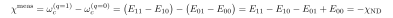

# Is the experimentally measured dispersive shift the same as $\chi_{\rm ND}$?

Yes — they are the **same spectral observable**. $\chi_{\rm ND}$ is "what the experiment would measure, computed from the model Hamiltonian." Follow-up to [09](09-chi-ND-labeling-bias.md) / [10](10-why-dressed-states-differ.md).

## Same finite difference

A readout experiment measures the cavity frequency with the qubit in $|0\rangle$ vs $|1\rangle$ (low probe power):

That is literally the $\chi_{\rm ND}$ finite difference. The experiment measures transition frequencies (spectral lines); $\chi_{\rm ND}$ computes the same energy differences from the model spectrum. If the model $\hat H_{\rm ND}$ is faithful, they coincide **by construction**. (Same for AC-Stark / number-splitting spectroscopy — the per-photon qubit shift is the same term.)

This is the EPR paper's central experimental claim: **Fig. 4 + Tables I–III** plot *measured* $\chi_{mn}$ vs *computed* $\chi_{mn}$, agreeing at the 5–10% level.

## They agree — and fail — together

Both face the labeling question; the experiment resolves it the same way: prepare $|0\rangle$/$|1\rangle$ (adiabatically-connected states), read off resolvable lines. In the dispersive regime $\to$ measured = $\chi_{\rm ND}$.

Near the [doc-09](09-chi-ND-labeling-bias.md) resonance, the experiment breaks down **in lockstep**:

- "qubit $|1\rangle$" hybridizes with the spectator $\to$ measurement-induced transitions, leakage, state-prep/readout corruption;
- cavity line broadens / splits; the pull becomes photon-number-dependent.

So you cannot cleanly measure "a" dispersive shift there either. The doc-09 bias is **not** "computation wrong, experiment right" — "the dispersive shift" is genuinely no longer a single number, and both the model spectrum and the real spectrum reflect that. Consistent.

## Where they can genuinely differ (model fidelity, not labeling)

When measured $\chi$ and $\chi_{\rm ND}$ disagree *where both are well-defined*, the cause is the **model**, not the concept:

1. **Incomplete/inaccurate model.** $\chi_{\rm ND}$ diagonalizes the *simulated* $\hat H$: finite mode set, junction as lumped inductor with $C_J \to 0$, approximate $E_J$ and materials. Missing a real mode, or wrong $E_J$, $\to$ real spectrum $\neq$ model spectrum. (Most of the paper's 5–10% residual; e.g. neglecting $C_J$ gives ~4% systematic on anharmonicity — see Methods.)
2. **Photon number / power.** Measured readout shift depends on probe $\bar n$ (higher-order dispersive, critical photon number); $\chi_{\rm ND}$ (0$\leftrightarrow$1) is the low-power limit. Compare like with like.
3. **Conventions.** Readout shift often quoted as $2\chi$ (full $|0\rangle$–$|1\rangle$ cavity separation); match the factor of 2 and the sign.

## Bottom line

In the dispersive regime, the measured dispersive shift and $\chi_{\rm ND}$ are the same quantity computed two ways — that equality is what the EPR method is validated on. Discrepancies come from **model completeness/accuracy, photon number, and conventions**; near resonances both lose meaning together. The experiment is ground truth for the spectrum; $\chi_{\rm ND}$ is the model's prediction of it.
