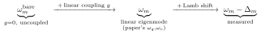
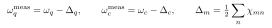

# How to get the "bare" qubit and resonator frequencies (and why they aren't $\omega_q$, $\omega_c$)

"Bare" is overloaded. There are **three** frequencies, and the paper's $\omega_q$, $\omega_c$ sit in the *middle*:

| Frequency | What it is | How to get it |
|---|---|---|
| **Linear eigenmode** $\omega_q$, $\omega_c$ | junction $\to$ linear inductor $L_J$; **includes** g-hybridization, **excludes** Lamb shift | FE eigenmode solver directly (pyEPR `f_0`) |
| **Dressed / measured** $\omega_m - \Delta_m$ | the physical transition you measure | subtract Lamb shift; pyEPR `f_1` (PT) or `f_ND` (numerical) |
| **Bare uncoupled** $\omega_m^{\rm bare}$ | mode if g were off (isolated transmon, empty cavity) | **not** a native EPR output (see (c)) |

## (a) You want the linear-circuit mode frequencies

Those *are* $\omega_q$, $\omega_c$ — read straight off the eigenmode simulation (`f_0`). But the paper's caveat: they "will be significantly perturbed by the Lamb shifts $\Delta_m$, and should be seen as an **intermediate parameter**" (after Eq. 16/17). Not what you measure.

## (b) You want the physical, measurable frequency

Then *not* $\omega_q$, $\omega_c$. It is the dressed frequency:

Get it by adding the Lamb shift (pyEPR `f_ND` / `f_1`), or just measure it. The paper compares to experiment using exactly these "dressed mode frequencies $\omega_m - \Delta_m$" (Comparison section / Tables).

## (c) You want the truly bare, g-uncoupled frequencies

Also **not** $\omega_q$, $\omega_c$ — and EPR does not hand these to you. The paper: the linear coupling g "is fully factored in our analysis, and is implicitly handled in the extraction of the operators." The eigensolver returns the *already-hybridized* modes. To recover g-uncoupled values, step outside the standard flow:

- simulate the pieces separately (cavity with the qubit chip removed $\to$ bare cavity; isolated transmon $\to$ bare qubit), or
- de-hybridize: fit the two eigenmode frequencies to a $2\times2$ coupling model $[[\omega_q^{\rm bare}, g], [g, \omega_c^{\rm bare}]]$ and back out $\omega^{\rm bare}$ and g.

In the EPR philosophy $\omega_m^{\rm bare}$ and g are not separately physical — only the hybridized eigenmodes are — which is why they aren't produced directly.

## Summary

- $\omega_q$, $\omega_c$ (paper) = **linear hybridized eigenmodes**: include g, exclude Lamb shift; intermediate.
- **Measured** qubit/resonator frequency = $\omega_m - \Delta_m$ (add the Lamb shift). This $\neq$ $\omega_q$, $\omega_c$.
- **Bare uncoupled** (g = 0) = neither; requires a separate sim or de-hybridization.

**Read in the paper:** the "intermediate parameter" caveat after Eq. (16/17); the g "fully factored" remark in Section II.A; the "dressed mode frequencies $\omega_m - \Delta_m$" in the Comparison section.
