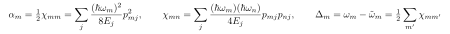

# Summary: extracting frequencies, anharmonicity, Lamb shift, dispersion from EPR

Practical recipe for a qubit ($q$) coupled to a resonator ($c$). Self-contained; ties together docs 07–12.

> Rendering: display equations are pre-rendered images (Warp has no math engine); inline math uses compilable `$...$` (renders in KaTeX/MathJax/GitHub/pandoc, shown raw in Warp).

## Notation

| Symbol | Meaning |
|---|---|
| $m, n$ | mode indices; here $q$ = qubit, $c$ = resonator/cavity |
| $j$ | junction index |
| $\hbar$ | reduced Planck constant |
| $E_j$ | Josephson energy of junction $j$ |
| $p_{mj}$ | energy-participation ratio of junction $j$ in mode $m$ (fraction of inductive energy) |
| $\omega_m$ | **linear** eigenmode angular frequency (junction = linear inductor); the paper's $\omega_q,\omega_c$ |
| $\Delta_m$ | Lamb shift of mode $m$ (vacuum-fluctuation frequency renormalization) |
| $\tilde\omega_m=\omega_m-\Delta_m$ | **dressed** (measured) angular frequency |
| $\alpha_m$ | anharmonicity (self-Kerr) of mode $m$ |
| $\chi_{mn}$ | cross-Kerr / dispersive shift between modes $m$ and $n$ |
| $g$ | linear qubit–resonator coupling (absorbed into the eigenmodes by EPR) |
| $\hat a_m,\hat a_m^\dagger,\hat n_m$ | annihilation / creation / number operators of mode $m$ |
| `f_0` | pyEPR: linear eigenmode freqs $\omega_m/2\pi$ (includes $g$, **no** Lamb shift) |
| `f_ND` | pyEPR: dressed freqs $\tilde\omega_m/2\pi$ from numerical diagonalization |
| `f_1` | pyEPR: dressed freqs, first-order perturbation theory |
| `chi_ND`, `chi_O1` | pyEPR Kerr matrices (numerical / perturbative): diagonal $=\alpha_m$, off-diagonal $=\chi_{mn}$ |
| `cos_trunc`, `fock_trunc` | cosine Taylor order / Fock levels per mode in the diagonalization |

## Pipeline

eigenmode sim (HFSS) $\to$ `DistributedAnalysis` (gives EPRs $p_{mj}$) $\to$ `QuantumAnalysis.analyze_all_variations(cos_trunc, fock_trunc)` (gives the fields below).

## How to get each quantity

| Quantity | How |
|---|---|
| **Measured qubit / resonator freq** | `f_ND[q]`, `f_ND[c]` $=\tilde\omega_m/2\pi=(\omega_m-\Delta_m)/2\pi$ — compare to experiment |
| **Linear eigenmode freq** $\omega_q,\omega_c$ | `f_0` (intermediate; *not* what you measure) |
| **Bare, $g=0$ freq** | not a direct output — separate sim (qubit alone / cavity alone) or a $2\times2$ de-hybridization fit (doc 12) |
| **Qubit anharmonicity** $\alpha_q$ | `chi_ND[q,q]` (diagonal); resonator $\alpha_c=$ `chi_ND[c,c]` (tiny, $\propto p_c^2$) |
| **Lamb shift** $\Delta_m$ | **operational:** `f_0[m] − f_ND[m]` $=\omega_m-\tilde\omega_m$. Analytic: $\Delta_m=\tfrac12\sum_{m'}\chi_{mm'}$ |
| **Dispersion** (cross-Kerr) $\chi_{qc}$ | `chi_ND[q,c]` (off-diagonal); readout shift $=\chi_{qc}$ per qubit excitation (quote $2\chi_{qc}$ for the full $\lvert0\rangle$–$\lvert1\rangle$ cavity separation) |

## Underlying formulas (single junction, in EPRs)

i.e. $\alpha_m=\tfrac12\chi_{mm}$, and $\Delta_m=\omega_m-\tilde\omega_m=\tfrac12\sum_{m'}\chi_{mm'}$, with $\chi_{mn}$ built from the participations $p_{mj}$ and junction energies $E_j$.

## Sign-convention note on the Lamb shift

The paper gives two forms: general $\Delta_m=\tfrac12\sum_{m'}\chi_{mm'}$ (which, with $\chi_{qq}=2\alpha_q$, gives $\Delta_q=\alpha_q+\chi_{qc}/2$ for two modes) and the example "$\Delta_q=\alpha_q-\chi_{qc}/2$." They differ by the sign of $\chi_{qc}/2$ — a convention wrinkle in that sentence. **Use the operational $\Delta_m=$ `f_0 − f_ND`** to avoid it.

## Recommendations

- Prefer `chi_ND` / `f_ND` (numerical) over `chi_O1` / `f_1` unless confirmed deep in the dispersive regime; their gap is the breakdown gauge (doc 07).
- Get $\Delta_m$ as `f_0 − f_ND`, not from $\alpha,\chi$ (avoids the sign ambiguity above).
- Verify labeled-state overlaps $\approx 1$ (doc 09); otherwise all of the above are suspect.
- For truly bare ($g=0$) values, see doc 12 — EPR absorbs $g$ into the eigenmodes.

## Read in the paper

`f_0` $\leftrightarrow\omega_m$ (Eq. 16/17, "intermediate parameter"); dressed $\omega_m-\Delta_m$ (Comparison section); $\alpha_m,\chi_{mn}\leftrightarrow$ Eqs. (9)–(12), (26); $\Delta_m=\tfrac12\sum_{m'}\chi_{mm'}$ near Eq. (25). Numerical diagonalization $\leftrightarrow$ ref [20], pyEPR [95].
