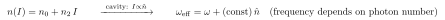
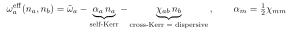
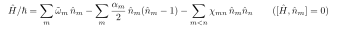
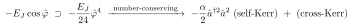

# An introduction to the Kerr Hamiltonian (demystifying the jargon)

Self-contained primer on "Kerr" language in circuit QED / the EPR context.

> Rendering: display equations are images (Warp); inline math is compilable `$...$`.

## Notation

| Symbol | Meaning |
|---|---|
| $m,n$ (or $a,b$) | mode indices |
| $j$ | junction index |
| $\hbar$ | reduced Planck constant |
| $E_j$ | Josephson energy of junction $j$ |
| $p_{mj}$ | energy-participation ratio of junction $j$ in mode $m$ |
| $\hat a_m,\hat a_m^\dagger,\hat n_m=\hat a_m^\dagger\hat a_m$ | ladder / number operators of mode $m$ |
| $\hat\varphi$ | junction reduced flux ($\hat\varphi_j=\sum_m\varphi_{mj}(\hat a_m+\hat a_m^\dagger)$) |
| $\omega,\tilde\omega_m$ | (bare-in-this-doc) and dressed mode angular frequencies |
| $\alpha_m$ | anharmonicity = self-Kerr of mode $m$ |
| $\chi_{mn}$ | cross-Kerr = dispersive shift between modes $m,n$ |
| $I,\ n_2$ | optical intensity and nonlinear-index coefficient (analogy only) |

## 1. Where the name comes from

The **optical Kerr effect** (J. Kerr, 1875): a material's refractive index depends on light intensity,

Defining feature: **a frequency that depends on how much excitation is present.** In a cavity, "intensity" = photon number $\hat n$, so a Kerr medium makes a mode's frequency depend on its own photon number. Everything else is bookkeeping.

## 2. A Kerr oscillator = an anharmonic oscillator

A harmonic oscillator has equally spaced levels $E_n=\hbar\omega\,n$. The **Kerr term** $-\tfrac{\alpha}{2}\hat a^{\dagger2}\hat a^2=-\tfrac{\alpha}{2}\hat n(\hat n-1)$ bends the ladder:

Levels become *unequally* spaced ($0\!\to\!1$ differs from $1\!\to\!2$ by $\alpha$). **The jargon collision:** in cQED the **self-Kerr** coefficient *is* the **anharmonicity** $\alpha$ — same number, two names. ($\alpha$ is what makes a transmon a usable qubit.)

## 3. Cross-Kerr = dispersive shift

With two modes, $-\chi_{ab}\hat n_a\hat n_b$ shifts mode $a$'s frequency by $-\chi_{ab}$ **per photon in $b$** (and vice versa):

"Cross-Kerr coupling" and "dispersive shift" are **synonyms**. Self-Kerr is just the cross-Kerr of a mode with itself, $\alpha_m=\tfrac12\chi_{mm}$ (the $\tfrac12$ from $n(n-1)$ vs $n_a n_b$).

## 4. The "Kerr Hamiltonian"

Key property: it is **diagonal in photon number** ($[\hat H,\hat n_m]=0$) — no mode exchanges energy with another; each just has a frequency that depends on all the occupations. That's why it's the convenient effective description, and it is exactly **Eq. (25)/(8)** of the paper.

## 5. Why Kerr shows up here

The Josephson nonlinearity $-E_J\cos\hat\varphi$ expands as harmonic + quartic + …; the number-conserving part of the quartic *is* self- and cross-Kerr:

So **the Josephson junction is the Kerr medium**, and $\alpha_m,\chi_{mn}$ are its Kerr coefficients — the EPR formulas (e.g. $\alpha_m=\sum_j\tfrac{(\hbar\omega_m)^2}{8E_j}p_{mj}^2$) just compute them from participations.

## Mini-glossary

| Term | Means |
|---|---|
| Kerr effect / nonlinearity | frequency depends on photon number |
| Kerr term | the quartic $-\tfrac{\alpha}{2}\hat a^{\dagger2}\hat a^2$ operator |
| Kerr oscillator | anharmonic oscillator (unequal level spacing) |
| Self-Kerr / Kerr constant | $=$ anharmonicity $\alpha$ (shift per its own photon) |
| Cross-Kerr $\chi_{mn}$ | shift per photon in another mode $=$ **dispersive shift** |
| Kerr Hamiltonian | the number-diagonal effective $H$ above (Eq. 25) |
| Anharmonicity | same as self-Kerr |
| Kerr medium | here, the Josephson junction |

## Read in the paper

The Kerr Hamiltonian is **Eq. (25)** (general) / **Eq. (8)** (qubit–cavity); $\chi_{mn}$ is **Eq. (26)**; $\alpha_m=\tfrac12\chi_{mm}$ stated below Eq. (25). The paper uses "anharmonicity," "cross-Kerr," and "dispersive shift" as established terms — this doc is the missing primer.
