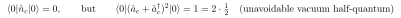
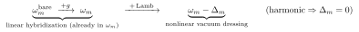
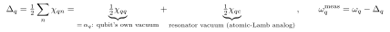
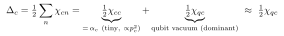
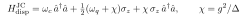
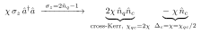

# Physical origin of the Lamb shift (one resonator + one qubit)

Self-contained. The name is borrowed from atomic physics; the analogy is exact, with a twist specific to the (an)harmonic-oscillator setting.

> Rendering: display equations are images (Warp); inline math is compilable `$...$`.

## Notation

| Symbol | Meaning |
|---|---|
| $q,c$ | qubit / resonator (cavity) mode |
| $\hat a_m,\hat a_m^\dagger,\hat n_m$ | ladder / number operators of mode $m$ |
| $g$ | linear qubit–resonator coupling |
| $\omega_m^{\rm bare}$ | bare, $g=0$ uncoupled frequency |
| $\omega_m$ | linear eigenmode (normal-mode) frequency — includes $g$, excludes Lamb shift |
| $\Delta_m$ | Lamb shift of mode $m$ |
| $\omega_m^{\rm meas}=\omega_m-\Delta_m$ | dressed / measured frequency |
| $\alpha_m$ | anharmonicity = self-Kerr ($=\tfrac12\chi_{mm}$) |
| $\chi_{qc}$ | cross-Kerr / dispersive shift |

## 1. The original Lamb shift (atoms, 1947)

H $2S_{1/2}$ and $2P_{1/2}$, degenerate in Dirac theory, are split. Cause: the electron couples to the **quantized EM vacuum** — it emits and reabsorbs *virtual* photons even with no real photons present, jiggling it and shifting its levels. **Lamb shift = level shift from coupling to vacuum fluctuations.**

## 2. The circuit-QED analog

The qubit frequency is shifted by the **zero-point fluctuations** of the fields it couples to — even with **zero real photons** in the resonator, whose vacuum still carries a half-quantum:

Those fluctuations, felt through the nonlinear (Kerr) coupling, pull the qubit frequency — that is $\Delta_q$.

## 3. The twist: it is a *nonlinear* effect

**Two *linearly* coupled *harmonic* oscillators have no Lamb shift** — bilinear coupling just makes normal modes, whose exact frequencies are the EPR eigenmodes $\omega_m$. The $g$-renormalization is *already inside* $\omega_m$. The Lamb shift appears only on restoring the **anharmonicity**:

No nonlinearity $\Rightarrow$ no Kerr $\Rightarrow$ $\Delta_m=0$. (For a *two-level* qubit the JC shift $g^2/\Delta$ is called a Lamb shift, but only because a two-level system is intrinsically nonlinear; the oscillator picture separates the linear piece cleanly into $\omega_m$.) This is the "$+g$" vs "$+$Lamb" arrows of [doc 12](12-bare-vs-dressed-frequencies.md).

## 4. Where the number comes from — vacuum half-quanta

The Lamb shift is the Kerr/cross-Kerr acting on the $\tfrac12$-quantum of vacuum in every mode:

- **$\alpha_q=\tfrac12\chi_{qq}$** — qubit dressed by its **own** zero-point motion sampling its anharmonic potential (self-dressing).
- **$\tfrac12\chi_{qc}$** — qubit dressed by the **resonator's** vacuum via the cross-Kerr. *This is the direct analog of the atomic Lamb shift* (dressed by another mode's photonic vacuum).

## The resonator Lamb shift $\Delta_c$ (mirror image)

$\Delta_c$ in Eq. (8) is the resonator's Lamb shift — the exact analog of $\Delta_q$, shifting the linear eigenmode $\omega_c$ to the measured $\omega_c-\Delta_c$. Same decomposition:

- $\alpha_c=\tfrac12\chi_{cc}$ — cavity dressed by its **own** vacuum sampling its (small) anharmonicity.
- $\tfrac12\chi_{qc}$ — cavity dressed by the **qubit's** vacuum via the cross-Kerr.

**Key asymmetry with $\Delta_q$:** a readout resonator barely touches the junction, so $p_c\ll1$ and the cavity self-Kerr $\alpha_c\propto p_c^2$ is tiny. Hence $\Delta_c\approx\tfrac12\chi_{qc}$ — the resonator's Lamb shift is **almost entirely qubit-vacuum-induced**, the mirror of the qubit case where $\Delta_q\approx\alpha_q$ (self-dominated). Physically: even with the qubit in $|0\rangle$, its zero-point fluctuations pull the cavity by $\tfrac12\chi_{qc}$ — the "$1$" of the $\tfrac12\chi_{qc}(2n_q+1)$ split (doc 05). So the cavity frequency you measure with the qubit in its ground state is already $\omega_c-\Delta_c$, not bare $\omega_c$.

**Virtual-photon view:** equivalently, the qubit virtually creates/reabsorbs excitations through the nonlinear terms; second-order energy denominators give $\Delta$. Same physics, PT language.

## Why does dispersive Jaynes–Cummings seem to have no $\Delta_c$?

It does have one — it's **hidden inside the $\chi\sigma_z\hat a^\dagger\hat a$ term**; the absence is a representation choice, not physics. The standard dispersive JC Hamiltonian:

writes the qubit Lamb shift explicitly ($\omega_q\to\omega_q+\chi$) but seems to give the cavity none. Map the two-level operator to occupation, $\sigma_z=2\hat n_q-1$:

The $-\chi\hat n_c$ piece **is** the cavity Lamb shift, $\Delta_c=\chi=\chi_{qc}/2$ (with $\alpha_c=0$, since the JC cavity is a perfect harmonic oscillator). Three ways to see why it "disappears":

1. **Tied to the ground state.** The cavity is pulled by $\chi\sigma_z$; with the qubit in $|g\rangle$ ($\sigma_z=-1$) it sits at $\omega_c-\chi$, not $\omega_c$ — that $-\chi$ is $\Delta_c$. The $\sigma_z$ form folds this constant shift together with the state-dependent pull; the normal-ordered oscillator form splits it out as an explicit $-\Delta_c\hat n_c$.
2. **The two-level "vacuum."** $\sigma_z=2\hat n_q-1$ ties the ground-state value $-1$ to the per-excitation slope $2\hat n_q$ — the two-level analog of the oscillator's $(\hat a_q+\hat a_q^\dagger)^2=2\hat n_q+1$ vacuum half-quantum. The constant cavity shift from coupling to that ground-state/vacuum is $\Delta_c$, exactly half the full $|g\rangle\!\to\!|e\rangle$ pull $\chi_{qc}=2\chi$.
3. **Reference convention.** JC writeups call $\omega_c$ the cavity frequency and absorb the constant into it; whether you label the leftover "$\Delta_c$" is a choice of where zero sits.

**One real difference:** JC's qubit shift $\Delta_q=\chi=\chi_{qc}/2$ is *missing the self-Kerr $\alpha_q$* that the full oscillator gives ($\Delta_q=\alpha_q+\chi_{qc}/2$) — a strict two-level model truncates the ladder and has no anharmonicity term; recovering the transmon's true shifts needs the $|2\rangle$ level (the "straddling" corrections). For the **cavity**, $\Delta_c=\chi_{qc}/2$ agrees exactly, since it's harmonic in both pictures.

## Read in the paper

"$\Delta$… due to the dressing of this nonlinear mode by quantum fluctuations of the fields" (after Eq. 8); $\Delta_m=\tfrac12\sum_n\chi_{mn}$ (below Eq. 25). See also [doc 05](05-chi-as-dispersive-shift.md) (Lamb vs dispersive; the $2n+1$ split) and [doc 12](12-bare-vs-dressed-frequencies.md) (frequency ladder).
