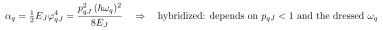
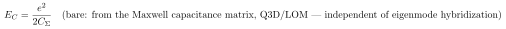
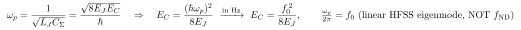
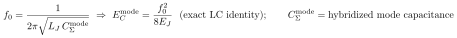
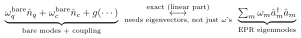

# Extracting $E_J$ and $E_C$ from an EPR analysis

Self-contained. The honest answer: EPR gives you only **one** genuinely bare parameter ($E_J$, the input); a clean $E_C$ comes from **electrostatics** (the capacitance matrix), not from the hybridized eigenmode spectrum.

> Rendering: display equations are images (Warp); inline math is compilable `$...$`.

## Notation

| Symbol | Meaning |
|---|---|
| $E_J$ | Josephson energy |
| $E_C=e^2/2C_\Sigma$ | charging energy; $C_\Sigma$ = total capacitance shunting the junction |
| $L_J=\varphi_0^2/E_J$ | junction linear inductance — the EPR simulation **input** |
| $\alpha_q$ | qubit anharmonicity (EPR `chi_ND[q,q]`) |
| $p_{qJ}$ | participation of the junction in the qubit mode |
| $\omega_q$ | dressed qubit mode frequency |
| $f_{\rm ND}$ | dressed qubit $0\to1$ frequency (EPR `f_ND[q]`) |

## The core tension

$(E_J,E_C)$ describe the **decoupled** qubit subcircuit (junction + its shunt capacitor). But EPR returns **hybridized eigenmodes** of the *coupled* system. So **every eigenmode quantity — frequencies *and* anharmonicities — carries the hybridization.** Only the input is bare.

In particular the anharmonicity is *not* a clean bare-qubit property:

It depends on the participation $p_{qJ}<1$ (the mode is partly cavity-like, diluting the anharmonicity) and on the dressed $\omega_q$. Deducing $E_C$ from $\alpha_q$ therefore folds in the hybridization.

## Where a clean $E_C$ comes from: electrostatics

$E_C$ is a capacitance, read from the **Maxwell capacitance matrix** — a circuit-element quantity that exists *before* any normal mode forms, independent of eigenmode hybridization:

In the qiskit-metal stack this is the **Q3D capacitance / LOM** path (`analyses/quantization/lom_core_analysis.py`) — a *separate electrostatic* analysis from EPR.

The two analyses are complementary:
- **EPR (eigenmode):** $E_J$ (input) + the hybridized, dressed Hamiltonian ($\omega,\alpha,\chi$).
- **Q3D / LOM (electrostatic):** $E_C=e^2/2C_\Sigma$, bare.

Clean combination: $E_J$ from the EPR input, $E_C$ from the capacitance matrix.

## What's bare vs tainted

| Quantity | Clean (bare) source | Tainted source |
|---|---|---|
| $E_J$ | EPR input $\varphi_0^2/L_J$ | — |
| $E_C$ | $e^2/2C_\Sigma$ from Q3D/LOM capacitance | $\alpha_q$ from EPR (hybridized, $\sim$few-% off) |

## If EPR is all you have

$\alpha_q$ is your best handle on $E_C$, but it is the hybridized-mode value: $\alpha_q\approx E_C\times(\text{participation dilution})$. For a transmon the qubit mode is junction-dominated ($p_{qJ}\approx0.98$–$0.999$), so the error is a few percent — usually acceptable, but it is a hybridization-tainted $E_C$, not a bare one. For precision, de-hybridize using $p_{qJ}$, or use the capacitance route.

If you do this, solve the **bare** CPB $\hat H=4E_C(\hat n-n_g)^2-E_J\cos\hat\phi$ (e.g. with `QPD(e_j_hz,e_c_hz)`) at the known $E_J$ for the $E_C$ that reproduces $\alpha_q$ — but read the result as "the $E_C$ consistent with the *measured/hybridized* anharmonicity," not the bare charging energy.

## Estimating $E_C$ from the plasma frequency (recommended eigenmode estimate)

The cleanest eigenmode-based estimate uses the **linear** qubit-mode frequency directly. The HFSS eigensolver treats the junction as a linear inductor $L_J=\varphi_0^2/E_J$, so the qubit-like mode is the LC plasma mode $\omega_p=1/\sqrt{L_JC_\Sigma}=\sqrt{8E_JE_C}/\hbar$. Invert:

with all quantities in Hz: $E_C=f_0^2/8E_J$. (Check, qpd defaults $E_J=8.335$, $E_C=0.695$ GHz: $f_0=\sqrt{8E_JE_C}=6.81$ GHz, $f_0^2/8E_J=0.695$ GHz.)

**Crucial:** use `f_0` (the raw linear eigenmode), **not** `f_ND`. The plasma frequency is the *harmonic* frequency; `f_ND` has the Lamb shift removed ($f_{\rm ND}\approx\sqrt{8E_JE_C}-E_C-\ldots$), so `f_ND` $\neq\omega_p$.

Caveats: `f_0` is the *hybridized* eigenmode, so this $E_C$ is the mode's effective charging energy with a small ($\sim g^2/\Delta$, sub-%) hybridization shift — not the truly bare $E_C$ (capacitance route). It is a **second, independent** estimate complementing $\alpha_q$; comparing $f_0^2/8E_J$ with $|\alpha_q|$ is a good consistency check — disagreement beyond a few % signals strong hybridization, mislabeling, or being far from the asymptotic regime ($E_J/E_C\sim10$–$20$).

## Is $E_C=f_0^2/8E_J$ exact? (eigenmode vs bare-mode picture)

Two different "exact"s here.

**(1) Exact as an identity, but for the *mode's* $E_C$.** The linear eigenmode genuinely is an LC oscillator, so the relation is just algebra:

It is exact by construction — but $C_\Sigma^{\rm mode}$ is the *hybridized* qubit mode's effective capacitance (it includes the mode's share of the cavity). So you get the *mode's* effective $E_C$ exactly, the *bare* qubit $E_C$ only up to hybridization. (Same as $\alpha_q$: every eigenmode quantity is hybridized.)

**(2) The "couple them and reproduce it" picture is what EPR does — forward.** The physical layout *has* a qubit, a resonator, and a *real* EM coupling (in the geometry). HFSS solves that coupled *linear* circuit and returns its **normal modes** — an *exact* diagonalization (finite-element, no RWA, no two-level truncation). The cosine nonlinearity is then projected onto those modes. So "couple and diagonalize" is exactly EPR, and exact at the linear level; the coupling is the real EM coupling, not a phenomenological $g$.

**But a Jaynes–Cummings model is not exact.** A literal JC — two-level qubit + linear $g$ + RWA — is an *approximation* (truncates the anharmonic ladder; JC's $\Delta_q$ misses $\alpha_q$, see [doc 15](15-lamb-shift-physical-origin.md)). The exact "bare-mode" Hamiltonian is the full anharmonic transmon + cavity + real coupling **including the whole cosine** — the *same* Hamiltonian as the EPR eigenmode one, in a different basis:

The linear parts are related by an exact canonical transformation, but it is *not* fixed by the two eigenfrequencies alone (3 bare parameters vs 2 frequencies) — you need the **eigenvectors** (field distributions / participations).

**Why EPR avoids the bare decomposition.** It works in the eigenmode basis precisely so it never has to define bare modes + $g$ — that split is ambiguous from frequencies alone and unnecessary, since the hybridized eigenmodes are the physical, measurable objects (the paper: $g$ is "fully factored… implicitly handled"). Your picture is the *inverse* (un-diagonalize to bare + $g$): valid and exact for the linear part, but it needs the eigenvector information — and for the bare $E_C$ specifically, the clean handle is the capacitance matrix, not the eigenfrequency.

## Why not use the dressed frequency `f_ND`?

It is the *most* contaminated quantity — hybridized **and** Lamb-shifted. Note, though, that the bare CPB $f_{01}=\sqrt{8E_JE_C}-E_C$ already contains the dominant ($\sim$200 MHz) self-anharmonicity Lamb shift (the $-E_C$); the residual difference from `f_ND` is only the small cross-Kerr Lamb shift $\tfrac12\chi_{qc}$ plus the linear hybridization. So treat `f_ND` as a **consistency check**, never as the bare $f_{01}$.

## Note vs. the EPR paper

The paper (arXiv:2010.00620) takes $E_J$ as input and reports $\alpha,\chi$; it does not parametrize in $(E_J,E_C)$. The bare $E_C$ lives in the electrostatic/capacitance description (LOM), which is complementary to EPR and underlies the `qpd` `fit_quantum_capacitance` workflow.
