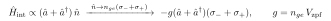
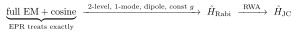

# What approximations make the constant-$g$ Rabi coupling valid?

Self-contained. The textbook resonator+qubit starting point is the **quantum Rabi model**,

$$\hat H_{\rm Rabi}=\omega_c\Big(\hat a^\dagger\hat a+\tfrac12\Big)-\tfrac12\omega_q\sigma_z-g(\hat a+\hat a^\dagger)(\sigma_-+\sigma_+).$$

Note it *keeps* the counter-rotating terms, so RWA is **not** the approximation behind the constant-$g$ coupling (that comes later, Rabi → JC). The bilinear, constant-$g$ term rests on four others.

> Rendering: display equations are images (Warp); inline math is compilable `$...$`.

## Notation

| Symbol | Meaning |
|---|---|
| $\hat a,\hat a^\dagger$ | single resonator mode ladder operators |
| $\sigma_z,\sigma_\pm$ | qubit (two-level) Pauli / raising-lowering operators |
| $\omega_c,\omega_q$ | resonator / qubit frequencies |
| $g$ | coupling strength |
| $\hat n$ | qubit charge operator (pre-truncation) |
| $n_{ge}$ | charge matrix element $\langle g|\hat n|e\rangle$ |
| $V_{\rm zpf}$ | zero-point voltage of the mode at the qubit |

## The four approximations

**1. Two-level truncation (the big one).** The atom/transmon is reduced to its lowest two levels → Pauli operators. The coupling is really between the field and the qubit's charge/dipole operator; projecting that onto $\{|g\rangle,|e\rangle\}$ keeps only the off-diagonal matrix element:

The single number $n_{ge}$ sets $g$. This discards the rest of the anharmonic ladder — exactly the levels that give the transmon its true Lamb/dispersive shifts (see [doc 15](15-lamb-shift-physical-origin.md)).

**2. Single-mode.** Only one resonator mode $\hat a$ is kept (the near-resonant one); the continuum of other EM modes is dropped.

**3. Dipole / linear (bilinear) coupling.** The interaction is taken to lowest order — linear in the field $(\hat a+\hat a^\dagger)$ (the mode voltage/E-field at the qubit) and linear in the qubit dipole/charge. Point-dipole approximation: the qubit is small vs the mode wavelength, so it sees one field amplitude. Higher-order coupling and the diamagnetic $\hat A^2$ term (here $\propto(\hat a+\hat a^\dagger)^2$) are neglected — relevant only in ultrastrong coupling.

**4. Constant, frequency-independent $g$.** $g=n_{ge}V_{\rm zpf}$ is a fixed number for the chosen mode and transition; it does not vary with frequency or drive. (For capacitive coupling the bilinear form is natural — capacitive coupling *is* linear in both the resonator voltage and the qubit charge; the approximation is the two-level projection giving the constant matrix element.)

## Not done here: RWA

The Rabi model retains $\hat a\sigma_-$ and $\hat a^\dagger\sigma_+$. Dropping them (valid for $g\ll\omega_c,\omega_q$ near resonance) gives Jaynes–Cummings:

## Connection to EPR

EPR makes **none** of these. It solves the full coupled *linear* EM problem exactly (finite-element eigensolve) — coupling exact and *implicit in the hybridized eigenmodes*, all modes available — and adds the **full cosine**, not a two-level truncation. The constant-$g$ Rabi/JC model is precisely the two-level + single-mode + bilinear-dipole reduction of what EPR keeps exact. That is also why EPR has no "$g$ term" at all ([doc 12](12-bare-vs-dressed-frequencies.md)): the coupling has been diagonalized into the eigenmodes rather than posited as a phenomenological constant.
