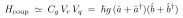
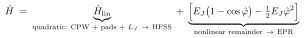
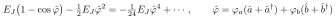

# Is there beyond-dipole CPW↔JJ coupling, and is its linearized part in HFSS?

Self-contained; a companion to [doc 17](17-rabi-model-approximations.md). The short answers: **yes**, the coupling goes beyond the simple dipole/bilinear term, and **yes**, the *linearized* part of all of it is captured exactly by the HFSS eigenmode solve — that is the foundational principle of EPR. The care is in separating two distinct meanings of "beyond dipole," because they are captured very differently.

> Rendering: display equations are images (Warp); inline math is compilable `$...$`.

## Notation

| Symbol | Meaning |
|---|---|
| $\hat a,\hat a^\dagger$ | resonator (CPW) mode ladder operators |
| $\hat b,\hat b^\dagger$ | qubit-like mode ladder operators |
| $\hat\varphi$ | junction phase (gauge-invariant) |
| $\varphi_m$ | zero-point phase of mode $m$ across the junction (EPR) |
| $C_g$ | mutual (coupling) capacitance |
| $V_r,V_q$ | resonator / qubit node voltages |
| $E_J,L_J$ | Josephson energy / linearized Josephson inductance |
| $g$ | bilinear coupling strength |

## What "dipole coupling" means here

In the Rabi/JC picture the coupling is the bilinear term $g(\hat a+\hat a^\dagger)(\sigma_-+\sigma_+)$ — **linear in the resonator field and linear in the qubit charge.** For the *capacitive* CPW↔qubit coupling of a QPD, this bilinear form is not really an electromagnetic approximation at all: the coupling energy is genuinely the mutual-capacitance energy,

exactly bilinear in resonator voltage and qubit charge. The "dipole approximation" that actually hides in the constant-$g$ model is the **two-level projection** ($n_{ge}$, doc 17 approximation 1), not the field structure.

## Two senses of "beyond dipole"

**(a) Higher EM multipoles / distributed coupling — still *linear*.** A real qubit has finite-size pads, so the resonator field varies across them and the coupling is not a single point-dipole number. This is the genuine "beyond point-dipole" correction. **But it is still linear in the fields** — it lives entirely in the quadratic (harmonic) sector of the Hamiltonian.

**(b) Nonlinear coupling — beyond *bilinear*.** Terms of higher order in field/charge: $\hat a^\dagger\hat a(\hat b+\hat b^\dagger)$, cross-Kerr $\chi\,\hat a^\dagger\hat a\,\hat b^\dagger\hat b$, and so on. In a QPD the **only** nonlinear element is the JJ, so *every* beyond-bilinear coupling traces back to the junction's $\cos\hat\varphi$. (The diamagnetic $\hat A^2$-analog $\propto(\hat a+\hat a^\dagger)^2$ is a linear-sector renormalization, not this.)

## The clean split

Write the full circuit Hamiltonian as a quadratic part plus the junction's nonlinear remainder:

The remainder $E_J(1-\cos\hat\varphi)-\tfrac12E_J\hat\varphi^2$ has, **by construction, zero linear and zero quadratic part** — it starts at $\hat\varphi^4$. Expanding it with the junction phase written in terms of *all* the normal modes is what produces the beyond-bilinear couplings:

The cross term $\varphi_a^2\varphi_b^2\,\hat a^\dagger\hat a\,\hat b^\dagger\hat b$ is the cross-Kerr — i.e. the dispersive shift $\chi$.

## What HFSS captures vs. misses

The HFSS eigenmode solve is the **exact solution of the linear EM problem with the junction replaced by its linear inductance $L_J$** (mesh accuracy aside):

| Coupling | In HFSS eigensolve? |
|---|---|
| Bilinear / point-dipole linear coupling | ✅ |
| Beyond-point-dipole *linear* coupling — multipole, distributed field, finite pad size, stray capacitance — sense (a) | ✅ full 3D Maxwell, **no multipole truncation** |
| Diamagnetic / $\hat A^2$-type linear renormalization | ✅ built into the capacitance matrix → dressed modes |
| Junction nonlinearity → Kerr, cross-Kerr $\chi$, anharmonicity — sense (b) | ❌ added afterward by EPR ($\cos$ expansion + participations) |

Note there is no explicit "$g$" to find in HFSS: the linear coupling, however intricate, is already **diagonalized into the hybridized normal modes** ([doc 12](12-bare-vs-dressed-frequencies.md), and the closing paragraph of doc 17).

## The principle, stated precisely

The linearized version of *any* coupling — dipole or beyond — is in HFSS, because

> Linearization = keeping the Hamiltonian quadratic = harmonic normal modes = exactly what a finite-element eigensolver computes.

Anything linear in the fields, no matter how geometrically intricate, lands in the linear normal-mode problem and is captured exactly. What HFSS leaves out is *only* the nonlinear remainder of the junction — and that remainder has, by construction, **zero linear part**, so there is nothing in it for an eigensolve to capture. EPR adds it back perturbatively through the energy-participation ratios ([doc 02](02-eq6-to-eq7.md), [doc 13](13-extracting-parameters-summary.md)).

So the division of labor is clean: **linear → HFSS (exact); nonlinear → junction $\cos$ expansion (EPR).** There is no beyond-dipole *linear* coupling that escapes HFSS, and no beyond-bilinear *nonlinear* coupling that comes from anywhere but the junction.

## QPD-specific note

The coupling is capacitive and the qubit is much smaller than the mode wavelength (lumped regime), so the point-dipole approximation is already excellent — the sense-(a) corrections are small. The key point is that they would be captured even if they weren't. And the sense-(b) cross-Kerr is not a nuisance here: it **is** the dispersive parity shift $\chi$ that QPD reads out ([doc 05](05-chi-as-dispersive-shift.md)).
