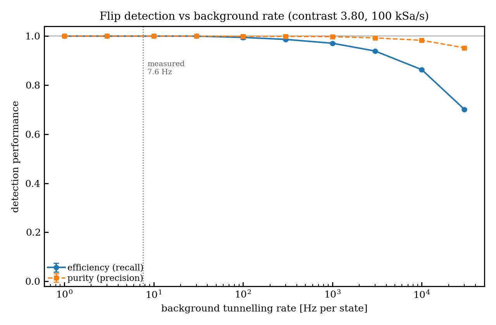
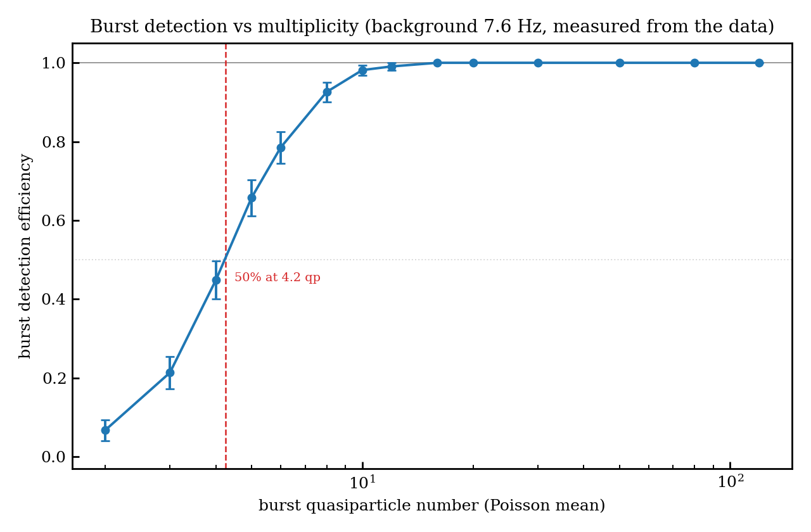
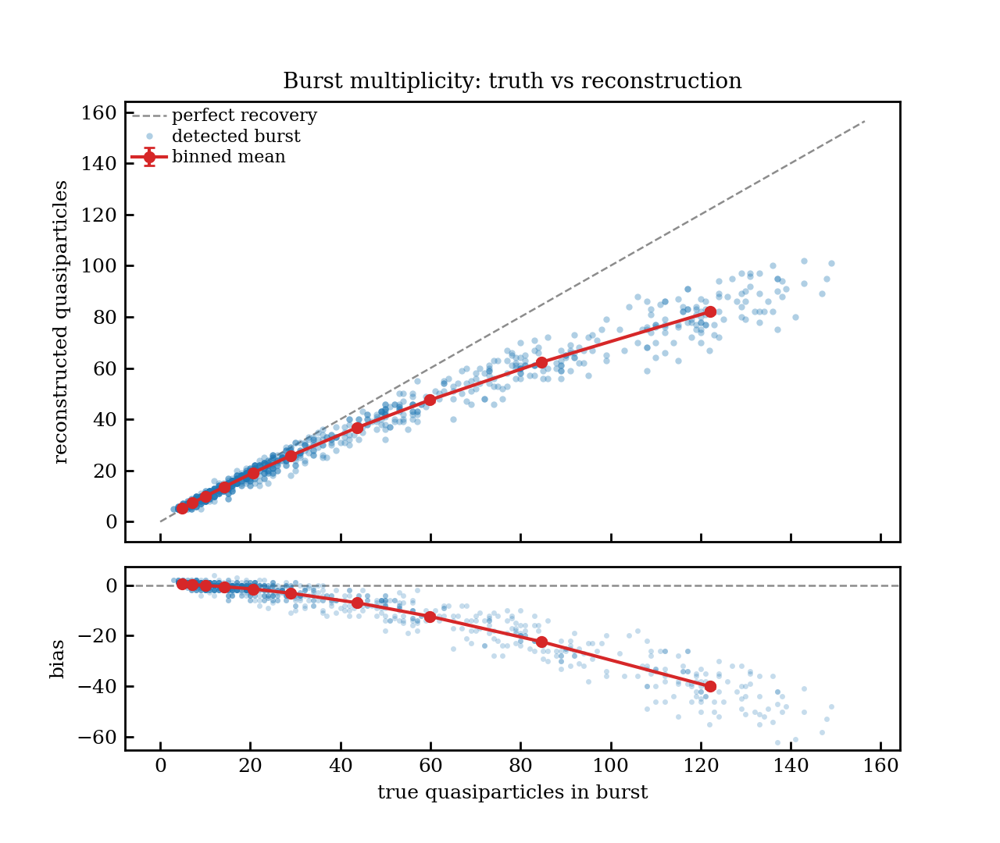
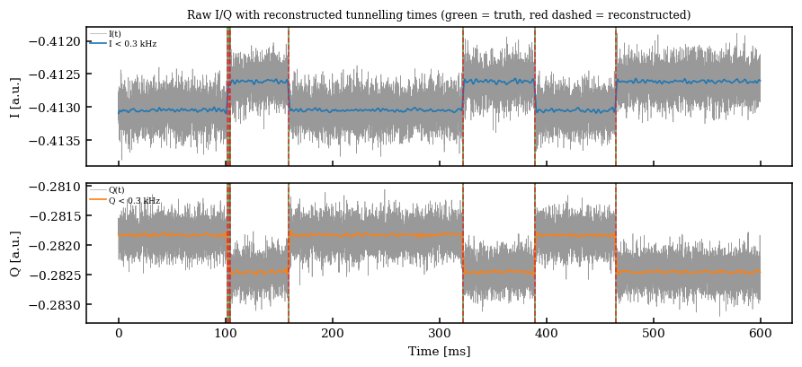

# Reconstructing charge-parity dynamics from a readout trace

**Methodology notes for `qpd.reconstruction`.**

These notes are written to be readable by someone who has taken an
undergraduate course in probability and linear algebra and has never seen a
hidden Markov model before. Every symbol is defined where it first appears, and
the statistical machinery is built up from scratch in [§5](#5-the-hidden-markov-model-hmm).

> **A note on the acronym.** The core of this method is a **HMM** — a *Hidden
> Markov Model*. That is a deterministic, exact inference algorithm for
> sequences. It is **not** HMC (*Hamiltonian Monte Carlo*), which is a random
> sampling method used in Bayesian fitting. They are unrelated; nothing here
> samples anything.

---

## Contents

1. [The physical problem](#1-the-physical-problem)
2. [Notation](#2-notation)
3. [Why the parity is visible at all](#3-why-the-parity-is-visible-at-all)
4. [Reducing the plane to a line](#4-reducing-the-plane-to-a-line)
5. [The hidden Markov model (HMM)](#5-the-hidden-markov-model-hmm)
6. [Case A — constant offset charge](#6-case-a--constant-offset-charge)
7. [Case B — swept offset charge](#7-case-b--swept-offset-charge)
8. [Nuisance 1 — sawtooth ramp resets](#8-nuisance-1--sawtooth-ramp-resets)
9. [Nuisance 2 — offset-charge jumps](#9-nuisance-2--offset-charge-jumps)
10. [Estimating the tunnelling rate](#10-estimating-the-tunnelling-rate)
11. [From a decoded sequence to flip times](#11-from-a-decoded-sequence-to-flip-times)
12. [Scoring against truth](#12-scoring-against-truth)
12b. [How good is it? Fidelity without truth](#12b-how-good-is-it-fidelity-without-truth)
12c. [Efficiency and accuracy on measured data, by surrogate replay](#12c-efficiency-and-accuracy-on-measured-data-by-surrogate-replay)
12d. [Diagnostics: rate response and burst response](#12d-diagnostics-rate-response-and-burst-response)
13. [What sets the limits](#13-what-sets-the-limits)
13b. [Knowing when it will not work](#13b-knowing-when-it-will-not-work)
14. [Reproducing the numbers](#14-reproducing-the-numbers)
14b. [Looking at the result](#14b-looking-at-the-result)
15. [Glossary](#15-glossary)

---

## 1. The physical problem

A QPD transmon is coupled to a readout resonator. The transmon's **charge
parity** — whether the number of electrons on the island is even or odd —
shifts the resonator frequency by a small amount. Because we drive the
resonator at a fixed frequency and record the transmitted microwave signal, that
frequency shift shows up as a shift in the complex transmission $S_{21}$.

The parity is not static. Every time a **quasiparticle** (a broken Cooper pair)
tunnels across the junction, the parity flips: even → odd → even → … The parity
is therefore a *random telegraph signal*: it holds a value for a random dwell
time, then toggles.

**The measurement.** We record the in-phase and quadrature voltages $I(t)$,
$Q(t)$ at a uniform sampling rate (100 kHz throughout, so one sample every
$\Delta t = 10\ \mu\text{s}$). We combine them into one complex number per
sample, $z_k = I_k + \mathrm{i}Q_k$.

**The goal.** Recover the **time of every tunnelling event** — a list of flip
times $\{\hat{t}_1, \hat{t}_2, \dots\}$ — from the trace alone.

**"Blind."** Throughout, the reconstruction is given *only* the trace and the
sampling rate. It is not told $E_J$, $E_C$, the coupling $g$, the resonator
parameters, the noise level, or how the offset charge was driven. Everything it
needs is estimated from the data. This is deliberate: it is what a reconstruction
applied to real measured data must do, and it prevents us from accidentally
scoring a method that only works because we handed it the answer.

Two optional inputs relax this when the hardware genuinely knows something —
`ramp_period` (§8.3) and `fold_period`. Both are *verified against the trace*
rather than trusted, and everything quoted in these notes is the fully blind
result unless stated otherwise.

Why this is hard, in one number: at the reference operating point a *single
sample* separates the two parity states by only about **2.7 standard
deviations of noise** — and for part of the time by much less. Classifying each
sample independently is hopeless. The whole method is about combining
information across many samples in the statistically correct way.

---

## 2. Notation

| Symbol | Meaning | Units |
|---|---|---|
| $t$ | time | s |
| $\Delta t$ | sampling period ($10\ \mu$s here) | s |
| $n$ | number of samples in the trace | — |
| $k$ | sample index, $k = 1 \dots n$; $t_k = (k-1)\Delta t$ | — |
| $z_k = I_k + \mathrm{i}Q_k$ | complex readout sample | a.u. |
| $n_g$ | offset charge, in units of one Cooper pair ($2e$) | — |
| $S_k \in \{A, B\}$ | hidden parity branch at sample $k$ | — |
| $\chi_{\mathrm{even}}, \chi_{\mathrm{odd}}$ | dispersive shift for each parity | Hz |
| $\Gamma$ | quasiparticle tunnelling rate (per state) | Hz |
| $p = \Gamma \Delta t$ | probability of a flip between consecutive samples | — |
| $\sigma$ | noise standard deviation, per quadrature | a.u. |
| $x_k$ | the trace projected onto one real axis (§4) | a.u. |
| $c(t)$ | *common mode*: midpoint of the two branches | a.u. |
| $h(t)$ | *signed splitting*: separation of the two branches | a.u. |
| $C = \lVert h \rVert/\sigma$ (magnitude of $h$ over $\sigma$) | **contrast** — separation in units of noise | — |
| $P$ | *fold period* — see §7 | s |
| $T$ | sawtooth ramp period — see §8 | s |
| $\delta$ | size of an offset-charge jump, in Cooper pairs | — |

Two conventions used everywhere:

- **Frequencies and rates are in Hz**, times in seconds (the repo-wide convention).
- The Cooper-pair box is **periodic in $n_g$ with period 1**. One Cooper pair
  is $2e$, so "half a Cooper pair" means $\Delta n_g = 0.5$.

---

## 3. Why the parity is visible at all

Two facts about the physics do all the work.

**Fact 1 — odd parity is even parity, shifted by half a Cooper pair.**

$$\chi_{\mathrm{odd}}(n_g) = \chi_{\mathrm{even}}\left(n_g + \frac{1}{2}\right)$$

and $\chi_{\mathrm{even}}$ is periodic with period 1 and is an even function of $n_g$.
So if we define the **signed splitting**

$$h(n_g) \equiv \chi_{\mathrm{odd}}(n_g) - \chi_{\mathrm{even}}(n_g),$$

then $h$ is periodic and, crucially, it **passes through zero**. The zeros sit at

$$n_g = 0.25 (\mathrm{mod}\ 0.5).$$

At those offset charges the two parity states produce *exactly the same*
resonator frequency. They are called **parity-blind points**: no measurement,
however long, can distinguish the parities there. This is physics, not a
shortcoming of the algorithm, and it recurs throughout these notes.

Numerically, for the reference device ($E_J/E_C = 12$, $g = 150$ MHz):

| $n_g$ | $\chi_{\mathrm{even}}$ (MHz) | $\chi_{\mathrm{odd}}$ (MHz) | $h$ (MHz) |
|---|---|---|---|
| 0.00 | 27.94 | 22.48 | −5.46 |
| 0.10 | 27.28 | 22.89 | −4.39 |
| **0.25** | **24.85** | **24.85** | **0.00** |
| 0.40 | 22.89 | 27.28 | +4.39 |
| 0.50 | 22.48 | 27.94 | +5.46 |

Note the sign flip either side of $n_g = 0.25$. Which branch is "upper" swaps
every time we cross a blind point — a bookkeeping detail that becomes important
in §7.

**Fact 2 — the drive is parked far off resonance.**

The readout tone sits a detuning $\Delta = 12.94$ MHz from the resonator,
against a linewidth $\kappa = 243$ kHz — so $|\Delta| = 53\kappa$. Far off
resonance the notch response linearises: the parity-dependent part of $S_{21}$
becomes one **fixed complex vector** multiplied by a *real* factor
$\propto 1/\Delta$. Two parities therefore differ only in that real scale, so
the difference vector cannot rotate — it can only change length and sign.

That is the whole justification for §4, and it is worth being careful about
*why*, because the obvious argument is wrong. The splitting is **not** small
compared with the linewidth: at 5.46 MHz it is $22\kappa$, and it is not small
compared with the detuning either ($0.42\Delta$). Neither ratio is what matters.
The residual rotation is set by $\kappa/\Delta \approx 0.02$, and measured over
$n_g \in [0, 0.5]$ the direction of the difference vector is constant to
**0.42 mrad**.

Fact 2 is what makes §4 possible.

---

## 4. Reducing the plane to a line

Each sample $z_k$ is a point in the complex plane. Under branch $S_k$ its
expected position is $\mu_{S_k}(t_k)$, and the measurement adds isotropic
Gaussian noise of width $\sigma$ **independently to $I$ and to $Q$**:

$$z_k = \mu_{S_k}(t_k) + \varepsilon_k, \quad \varepsilon_k \sim \mathcal{N}(0,\sigma^2) + \mathrm{i} \mathcal{N}(0,\sigma^2).$$

By Fact 2 the two means $\mu_A$ and $\mu_B$ differ only along one fixed
direction. Call the unit vector along that direction $\hat{d}$ (a complex number
of modulus 1). Then all the parity information lies in the component of $z_k$
along $\hat{d}$; the perpendicular component is pure noise and can be discarded.

Define the **projection**

$$x_k \equiv \mathrm{Re}\left[ \overline{\hat{d}} (z_k - o) \right],$$

where $\overline{\hat{d}}$ is the complex conjugate and $o$ is any convenient
origin (we use the mean of the trace). Because a projection of an isotropic
Gaussian is a 1-D Gaussian of the *same* width, $x_k$ satisfies

$$x_k \sim \mathcal{N}(m_{S_k}(t_k),\ \sigma^2),$$

with $m_A, m_B$ the projected branch means. **The two-dimensional problem is now
one-dimensional, with no loss of information.**

**Finding $\hat{d}$ blind.** The cloud of all samples is an isotropic blob
smeared out along one line. Its covariance matrix therefore has a large
eigenvalue along $\hat{d}$ and a small one perpendicular to it. So:

- $\hat{d}$ = principal (major) eigenvector of the sample covariance;
- $\sigma$ = square root of the **minor** eigenvalue.

That second point is a small gift: the minor axis carries noise *only*, so it
gives an estimate of $\sigma$ that needs no assumption about the flip rate or the
ramp. (`estimate_direction` in [`emission.py`](../src/qpd/reconstruction/emission.py).)

It is convenient to write the two projected means as a midpoint plus a splitting:

$$m_A = c + \frac{h}{2}, \quad m_B = c - \frac{h}{2},$$

so $c$ is the **common mode** and $h$ the **signed splitting**. The **contrast**

$$C = \frac{|h|}{\sigma}$$

is the single most important number in these notes: it is the branch separation
measured in units of the noise. At the reference operating point the median
contrast is $C \approx 2.7$.

---

## 5. The hidden Markov model (HMM)

This section assumes no prior exposure. We build the model, then derive the two
algorithms we need.

### 5.1 What we know and what we want

We know the sequence of measurements $x_1, \dots, x_n$. We want the sequence of
parities $S_1, \dots, S_n$, which we cannot see — hence *hidden*.

A single sample tells us very little: with $C \approx 2.7$ the two candidate
Gaussians overlap substantially, so a per-sample guess is wrong maybe 10% of the
time — which over $10^6$ samples would mean $10^5$ spurious "flips." What saves
us is that **parity flips are rare**. At $\Gamma = 10$ Hz the parity holds for
about 100 ms, i.e. $10^4$ consecutive samples. Combining $10^4$ samples that each
carry contrast 2.7 gives an overwhelming determination of which branch we are on.

The HMM is exactly the machinery for combining evidence across a sequence in a
way that respects "flips are rare."

### 5.2 The two ingredients

**(a) The transition model** (the prior on how the hidden state evolves).

The parity is a *Markov chain*: the probability of the next state depends only on
the current state, not on the whole history. For a symmetric telegraph with rate
$\Gamma$ per state, the probability of flipping between two consecutive samples is

$$p = \Gamma \Delta t .$$

(At $\Gamma = 10$ Hz and $\Delta t = 10\ \mu$s, $p = 10^{-4}$ — flips are indeed
rare per sample.) The transition matrix is

$$\mathbf{T} = \begin{pmatrix} 1-p & p \\ p & 1-p \end{pmatrix},
 \quad T_{ss'} = P(S_{k+1}=s' \mid S_k = s).$$

This is the term that stops one noisy sample from being read as a flip: flipping
"costs" a factor $p/(1-p)$ in probability, so the evidence has to be worth more
than that.

**(b) The emission model** (how a hidden state produces an observation).

Given the branch, the sample is Gaussian about that branch's mean:

$$P(x_k \mid S_k = s) = \frac{1}{\sqrt{2\pi\sigma^2}}
\exp\left[-\frac{(x_k - m_s(t_k))^2}{2\sigma^2}\right].$$

We work with the logarithm, $\ell_k(s) \equiv \log P(x_k \mid S_k=s)$, because
products of $10^6$ small numbers underflow any floating-point format.

Note the means carry a time argument: in the ramped case (§7) they *move* from
sample to sample. The HMM does not care — it only ever needs $\ell_k(s)$.

### 5.3 The forward–backward algorithm (posterior probabilities)

We want, for each $k$, the probability that the branch was $B$ **given the whole
trace**:

$$\gamma_k = P(S_k = B \mid x_1, \dots, x_n).$$

Note "given the whole trace" — including samples *after* $k$. Data from the
future genuinely helps: if the next 5000 samples all look like branch $B$, that
is strong evidence sample $k$ was already $B$.

Define two quantities:

$$\alpha_k(s) = P(x_1, \dots, x_k,\ S_k = s) \quad\text{— the forward variable}$$

$$\beta_k(s) = P(x_{k+1}, \dots, x_n \mid S_k = s) \quad\text{— the backward variable}$$

**Forward recursion.** To be in state $s'$ at step $k+1$ having seen the data so
far, we must have been in *some* state $s$ at step $k$, transitioned, and then
emitted $x_{k+1}$:

$$\alpha_{k+1}(s') = \left[ \sum_{s} \alpha_k(s) T_{ss'} \right] P(x_{k+1} \mid s')$$

started from $\alpha_1(s) = P(S_1=s)P(x_1\mid s)$, with $P(S_1=s) = 1/2$ (we have
no prior preference for even or odd).

**Backward recursion.** Symmetrically, running from the end of the trace inwards:

$$\beta_k(s) = \sum_{s'} T_{ss'} P(x_{k+1} \mid s') \beta_{k+1}(s')$$

started from $\beta_n(s) = 1$.

**Combining.** Because the chain is Markov, past and future are conditionally
independent given the present state, so

$$P(S_k = s,\ \text{all data}) = \alpha_k(s) \beta_k(s),$$

and normalising over the two states gives what we wanted:

$$\gamma_k = \frac{\alpha_k(B)\beta_k(B)}{\alpha_k(A)\beta_k(A) + \alpha_k(B)\beta_k(B)}.$$

Both recursions visit each sample once, so the cost is $O(n)$ — linear in the
length of the trace, with only two states to track.

**Numerical care.** $\alpha_k$ shrinks geometrically and would underflow within a
few hundred samples. The implementation rescales $\alpha$ to sum to 1 at every
step and accumulates the discarded factors as a running log. This is exact (the
scale factors cancel in $\gamma_k$) and the accumulated log is precisely the
total log-likelihood $\log P(x_1,\dots,x_n)$, which we reuse in §8 for model
selection. See `forward_backward` in [`hmm.py`](../src/qpd/reconstruction/hmm.py).

**How to read $\gamma_k$.** It is a soft curve between 0 and 1. At a real flip it
swings sharply from ~0 to ~1 over a few samples. Inside a parity-blind window,
where the data says nothing, it drifts back toward $1/2$ — the model reports
honest ignorance instead of guessing.

### 5.4 The Viterbi algorithm (the single best sequence)

The posterior gives a per-sample probability. To *count events* we want one
definite sequence: the single most likely assignment $S_1,\dots,S_n$ as a whole.
That is the **Viterbi** algorithm — dynamic programming, structurally the same as
the forward recursion but with $\sum$ replaced by $\max$:

$$\delta_{k+1}(s') = \max_{s} \left[ \delta_k(s) + \log T_{ss'} \right] + \ell_{k+1}(s')$$

working in logs throughout ($\delta_k(s)$ is the log-probability of the best path
that ends in state $s$ at step $k$). At each step we record *which* $s$ achieved
the maximum; at the end we take the better final state and walk the recorded
choices backwards to read off the whole path. Also $O(n)$.

The result is a clean square wave. Flip events are exactly its transitions.

### 5.5 Why this beats a threshold

A naive detector — smooth the trace, threshold it, call each crossing a flip —
has a fixed averaging window, and you must choose it. Too short and noise
manufactures flips; too long and real flips are smeared away.

The HMM has no such knob. Weighting the evidence by the dwell-time prior makes it
behave like a **matched filter whose averaging length adapts automatically**: it
integrates for a long time where the branches are close (low contrast) and
responds quickly where they are well separated. That adaptivity is what makes a
per-sample contrast of order unity workable at all.

---

## 6. Case A — constant offset charge

Start with the easy regime, because it isolates the HMM from everything else.

If $n_g$ is **held fixed**, the two branch means do not move. In the I/Q plane
you see two stationary blobs, and the trace hops between them. There is no fold
period, no blind point sweeping past, no ramp reset. Entry point:
`reconstruct_parity_flips_static` ([`static_bias.py`](../src/qpd/reconstruction/static_bias.py)).

The projected data is a **two-component Gaussian mixture**:

$$P(x) = w \mathcal{N}(x; m_A, \sigma^2) + (1-w) \mathcal{N}(x; m_B, \sigma^2),$$

with $w$ the fraction of time spent in branch $A$. We fit $m_A, m_B, \sigma, w$
by **expectation–maximisation (EM)**, which alternates two steps until converged:

- **E-step** — given current parameters, compute each sample's *responsibility*,
  the probability it came from branch $A$:
  $$r_k = \frac{w \mathcal{N}(x_k; m_A,\sigma^2)}{w \mathcal{N}(x_k; m_A,\sigma^2) + (1-w) \mathcal{N}(x_k; m_B,\sigma^2)}.$$
- **M-step** — re-estimate the parameters as responsibility-weighted averages:
  $$m_A = \frac{\sum_k r_k x_k}{\sum_k r_k}, \quad m_B = \frac{\sum_k (1-r_k) x_k}{\sum_k (1-r_k)}, \quad w = \frac{1}{n}\sum_k r_k,$$
  and $\sigma^2$ as the pooled weighted variance.

EM is initialised by splitting at the **median** of $x$. That is a deliberate
choice: splitting at the extremes (k-means style) biases the two centres outward
when the blobs overlap, whereas for the balanced occupancy of a symmetric
telegraph the median split is unbiased.

Then feed $m_A$, $m_B$, $\sigma$ into the HMM of §5 and read off the transitions.
That is the entire static pipeline.

### 6.1 A trap: EM always "succeeds"

Fit two Gaussians to data that is really *one* Gaussian and EM will still return
two components — it splits the single blob into a spurious pair, typically
reporting a contrast near 0.9. **So the fitted contrast alone cannot tell you
whether the bias point carries any parity information.** At the parity-blind
charge $n_g = 0.25$, where the truth is that no information exists, the fit looks
superficially the same as at a good bias point.

One honest tell is the *combination* of contrast and decoded dwell time. Define

$$\text{detectability} = C \sqrt{N_\mathrm{dwell}}, \quad N_\mathrm{dwell} = 1/p,$$

the contrast integrated over one dwell (the $\sqrt{N}$ is the usual averaging
gain for $N$ independent samples). If the decoder is really segmenting noise the
fitted rate is inflated, the dwell collapses, and the product falls: measured on
the reference device, 105 at $n_g = 0.22$, which works, against 6 at
$n_g = 0.24$, which does not.

**But detectability alone is not scale-free, and neither statistic works by
itself.** A genuinely *fast* telegraph also has a short dwell, so a 3 kHz device
scores only ~22 while still reconstructing at $F_1 = 0.97$. The per-sample
contrast covers exactly that gap — and fails where detectability works, since EM
splits a single blob into a spurious pair with contrast ≈0.9 and so cannot
separate a blind point (0.90) from a marginal but usable one (0.96).

The flag therefore requires **both** to fail, which is what makes it trustworthy
in each direction:

| case | contrast | detectability | `degenerate` | true $F_1$ |
|---|---|---|---|---|
| $n_g=0$, 10 Hz | 3.78 | 432 | False | 1.000 |
| $n_g=0$, 3 kHz | 3.78 | 22 | False | 0.969 |
| $n_g=0.22$, 10 Hz | 0.96 | 105 | False | 0.905 |
| $n_g=0.24$, 10 Hz | 0.90 | 6 | **True** | 0.015 |

When it fires the correct response is to **move the bias point**, not to salvage
the output. (The two-blob-versus-one-blob likelihood gain was also tried as a
rate-invariant replacement and is useless here: ≈0 for the usable $n_g = 0.22$
and the blind $n_g = 0.24$ alike.)

---

## 7. Case B — swept offset charge

Now the case the notebook actually simulates: $n_g$ is **ramped** with a sawtooth
at 500 Hz, spanning 5.5 Cooper pairs. Entry point
`reconstruct_parity_flips_ramped` ([`reconstruct.py`](../src/qpd/reconstruction/reconstruct.py)).

Sweeping helps and hurts. It helps because no flip is stuck at a bad bias point
forever — the contrast sweeps, so every flip eventually sees good separation.
It hurts because the branch means now *move*, and we must learn how.

### 7.1 The fold period

Since $|h|$ is periodic in $n_g$ with period 0.5, and a linear ramp makes $n_g$
proportional to $t$, the splitting is periodic **in time**:

$$P = \frac{0.5}{\text{ramp slope}}$$

which we call the **fold period**.

For the reference scenario the slope is $5.5 \times 500 = 2750$ per second, so
$P = 181.8\ \mu$s — about 18 samples.

### 7.2 Finding $P$ blind: look at the variance, not the mean

Here is the key trick. The **common mode barely moves** — the midpoint $c$
between the branches is nearly constant. What the ramp modulates is the
*separation*. So the parity signal lives in the trace's **spread**, not its mean,
and averaging the trace would destroy it.

Consider the square of the projection. Over a phase bin where the parity is
equally likely to be $A$ or $B$, the mean of $x$ is $c$ and

$$E\left[(x-c)^2\right] = \sigma^2 + \left(\frac{h}{2}\right)^2 = \sigma^2 + \frac{h^2}{4}.$$

The first term is the noise; the second is the branch offset.

*Derivation:* with probability $1/2$ the sample sits at $c + h/2$ plus noise, and
with probability $1/2$ at $c - h/2$ plus noise. In either case the offset from
$c$ is $\pm h/2$, whose square is $h^2/4$; the noise contributes $\sigma^2$ and is
independent, so the variances add.

So $x^2$ contains a strong periodic tone at the fold frequency $1/P$. We locate it
with a periodogram (an FFT of $x^2$), then **refine** it, because raw FFT
resolution is nowhere near good enough: a 5 s trace at $P = 182\ \mu$s contains
27 500 cycles, so a relative period error of only $3\times10^{-5}$ slides the
model three quarters of a cycle out of phase by the end of the trace. Refinement
maximises the *folded contrast* — fold the trace at a trial period, bin by phase,
and take the variance of the resulting profile; this is sharpest at the true
period because a wrong period smears the profile flat.

### 7.3 Folding, and the profile

With $P$ in hand, assign each sample a **phase**
$\varphi_k = \mathrm{frac}(t_k/P) \in [0,1)$, bin the samples by $\varphi$,
and in each bin compute the mean and variance of $x$. Then

$$c(\varphi) = \text{bin mean}, \quad |h(\varphi)| = 2\sqrt{\max(\text{bin variance} - \sigma^2,\ 0)},$$

inverting the relation above. Because every bin pools thousands of samples from
across the whole trace, the profile is measured very precisely even though any
individual sample is noisy.

### 7.4 Recovering the sign

The fold gives $|h|$, but the HMM needs the *signed* $h$ — it must know which
branch is currently upper. From §3, $h$ changes sign at every parity-blind point,
and there is exactly one blind point per fold period (the minimum of $|h|$). So
the sign simply **alternates from one half-cycle to the next**:

$$h(t) = (-1)^{\lfloor t/P - \varphi_{\mathrm{blind}}\rfloor} |h(\varphi)|.$$

The overall sign is not identifiable — flipping it globally just swaps the labels
"even" and "odd." That is harmless: it does not move any flip *time*, which is
all we are reporting.

### 7.5 Robustness of the period estimate

One refinement worth knowing, because it caused a real failure during
development. If a charge jump (§9) sits in the middle of the trace, the
whole-trace folding objective can trade the phase step against a small period
error, biasing the period by $3\times10^{-5}$ — enough to ruin everything
downstream. The fix: estimate the period **independently in several windows and
take the median**. A jump falls in only one window, so the median is untouched by
it. (`estimate_fold_period`, `min_cycles_per_window`.)

---

## 8. Nuisance 1 — sawtooth ramp resets

This is the dominant systematic in the swept case, and the most instructive.

The sawtooth spans 5.5 Cooper pairs. In units of half-pairs that is
$5.5/0.5 = \mathbf{11}$ — an **odd** number. So when the ramp resets, $n_g$ jumps
by 5.5, which modulo 1 is exactly **0.5**: half a Cooper pair. And by Fact 1
(§3), shifting $n_g$ by half a pair maps each parity branch *exactly onto the
other*.

**A ramp reset is therefore observationally identical to a parity flip.** The
signal does precisely what a tunnelling event would do. No per-event test can
distinguish them, because there is no difference to detect.

The numbers make this severe. At a 500 Hz ramp there are 500 resets per second;
at $\Gamma = 10$ Hz there are ~10 real flips per second. That is **~50 artefacts
for every real event**.

### 8.1 Why you cannot fix this afterwards

The tempting approach is to detect all events, notice that some are strictly
periodic, and delete those. This fails badly here. To delete one event per 2 ms
cycle you need a matching window; with a window comparable to the timing
tolerance you would also delete a substantial fraction of the *real* flips that
happen to fall near a reset phase. You cannot win: the artefacts are 50× more
numerous, so even a small collateral rate destroys the result.

### 8.2 The fix: put the resets in the model

Resets are strictly **periodic**, while tunnelling is **Poisson** (random). That
is the one statistical difference available, and it is a property of the
*ensemble*, not of any single event.

So: run a short first-pass decode. Its event list is dominated by reset
artefacts. Fold those times at candidate periods and look for a sharp pile-up at
one phase — random events spread out, a comb piles up. The search is restricted
to integer multiples of the already-known fold period $P$ (the ramp spans a whole
number of half-pairs, so the reset interval must be $T = mP$ for integer $m$),
which makes it both cheap and sharp. On the reference scenario this returns
$m = 11$, $T = 2.0000$ ms with a pile-up significance of several hundred sigma.

Then, instead of deleting anything, **add an extra sign flip at each reset time**
to the sign schedule of §7.4. The emission model now knows that the branches swap
at those instants, so the decoder simply follows them through — and reports **no
event at all**. The artefacts never enter the output.

The comb is accepted only if it **improves the total log-likelihood** (available
free from the forward pass, §5.3). This gate means a trace with no such ramp —
a static bias, an even-span sawtooth, a triangle wave with no reset — is left
untouched.

Measured effect of turning the reset model off and on (`model_ramp_resets`):
hard $F_1$ goes **0.034 → 1.000** on a clean 5 s trace and **0.151 → 0.933**
with quasiparticle bursts present. **0 of 2500** resets leak into the output.

### 8.3 If the ramp period is known from the hardware

The generator's frequency is usually known to far better precision than this
analysis needs, while its trigger offset relative to the digitiser is not. That
asymmetry is worth exploiting, and `reconstruct_parity_flips_ramped` takes
`ramp_period=T` for it. The phase does **not** need to be supplied.

Knowing $T$ does three things:

1. **The fold period is re-locked** to $P = T/m$ for integer $m = \mathrm{round}(T/\hat P)$ — the generator's precision rather than the fit's.
2. **The harmonic ambiguity disappears** — no search over candidate multiples.
3. **The phase becomes a one-parameter problem**, found by scanning the HMM likelihood over $\varphi \in [0, T)$. This does not use the first-pass event list at all; it asks the trace directly which reset phase best explains it, which is why it survives where the blind search has already failed.

The gain is concentrated entirely at low contrast, because comb detection — not
decoding — is what fails first:

| contrast | blind | `ramp_period=T` |
|---|---|---|
| 2.66 | 1.000 | 1.000 |
| 1.34 | 0.952 | 0.952 |
| 0.90 | 0.899 | 0.899 |
| **0.67** | **0.023** (comb lost) | **0.920** |

Above contrast ≈1.3 it changes nothing. Its value is moving the breakdown from
a contrast near 0.9 down to about 0.5.

**A supplied period is not taken on trust.** Commensurability is no test —
almost any value sits near *some* integer multiple of $P$, so a wrong one
passes that check and then produces garbage (measured: $1.37 T$ accepted as
$m = 15$, F1 0.002). The supplied period must instead earn its place on the same
two tests the blind comb faces: it must improve the likelihood over using no
comb, and leave no periodic residue in the output. If it fails, the model is
restored to its pre-lock state, the blind search runs, and
`ramp_period_rejected` appears in the diagnostics.

Below contrast ≈0.5 the fold period itself is no longer detectable from the
spectrum, and `ramp_period` alone cannot help — pass `fold_period=T/m` as well,
which needs $m$, i.e. the ramp span in Cooper pairs (gate lever arm × amplitude).
With both supplied, F1 0.016 → 0.784 at contrast 0.45.

---

## 9. Nuisance 2 — offset-charge jumps

Occasionally (~0.1 Hz) a stray charge shifts $n_g$ abruptly by some $\delta$.

A jump and a flip look different, and the difference is what lets us handle them:

- a **parity flip** moves the signal *between* two branch curves that themselves
  stay put — a transient change;
- a **charge jump** slides *both* curves along the ramp phase, by $2\delta$ in
  fold-period units (one fold period is half a Cooper pair, hence the factor 2).
  The learned model is then wrong from the jump onward — a persistent change.

So we detect the jump as a **change point** in the fitted ramp phase, re-fit one
phase offset per segment, and emit no flip at the boundary. Jump *amplitudes* are
not reported; they are not a target here.

**This cannot be skipped.** A jump near $\delta = 0.25$ shifts the phase by
exactly half a cycle, which inverts which branch is which; the decoder then
flip-flops constantly and $F_1$ collapses from 0.98 to **0.21**.

Two subtleties, both found the hard way:

1. **Chicken-and-egg.** You need a splitting profile to find the jump, but a
   whole-trace profile is already corrupted *by* the jump. Worst at
   $\delta = 0.25$, which blends the profile with its own half-period shift,
   making it nearly period-$\frac12$ — at which point an offset of 0 is
   indistinguishable from 0.5. Fix: build the profile from a **single window**
   (jump-free for every window the jump misses) and pick the window with the
   highest contrast, since blending always costs contrast.
2. **Coupling with the period.** A phase step biases the period (§7.5) and a
   biased period drifts the phase in a way that mimics a step. The two are
   estimated by **alternating** between them until stable.

**Irreducible case.** A jump of exactly $\delta = \pm 0.5$ (mod 1) maps each
branch onto the other — the same degeneracy as a ramp reset, but occurring at a
random time, so the periodicity argument of §8 does not apply. It is reported as
a flip. This is a genuine limit of the measurement, not of the algorithm.

---

## 10. Estimating the tunnelling rate

The transition probability $p$ is itself unknown. It is estimated by **hard EM**:

1. decode with the current $p$;
2. count the crossings of the thresholded posterior ($\gamma_k$ passing
   $1/2$) — a cheap stand-in for Viterbi transitions, which agrees with them
   except inside parity-blind windows — and set
   $p \leftarrow (\text{count})/(n-1)$;
3. repeat until stable (a handful of iterations).

The rate only sets the decoder's *prior*, so this crude scheme is adequate — a
full Baum–Welch update would cost an extra sweep per iteration for no measurable
gain. Measured recovery: 1 Hz → 1.0, 10 Hz → 9.2, 100 Hz → 98.8, 300 Hz → 292.7.

---

## 11. From a decoded sequence to flip times

The Viterbi path changes state between two samples, so the flip happened
somewhere in that $10\ \mu$s interval. Rather than taking the midpoint, we read
off where the **posterior odds cross even** — linearly interpolating $\gamma_k$
between the bracketing samples to find where it passes $1/2$. With a $10\ \mu$s
sample period against a $0.5$ ms matching tolerance this is a small correction,
but it is free and unbiased.

Each flip also carries a **confidence**: the size of the posterior swing across
the transition, in $[0,1]$. This collapses toward zero for flips inside a
parity-blind window, giving a principled handle for trading recall against
precision. (Note: in the measured failure modes the false positives turned out to
be *high*-confidence, so this is a diagnostic, not a cure-all.)

---

## 12. Scoring against truth

Reusing `qpd.mlebench.grade`, so reconstruction is scored the same way the
benchmark datasets are.

**Matching.** Predicted times are matched one-to-one to true times, minimising
total timing error subject to a hard tolerance of 0.5 ms. This is a bipartite
assignment problem, solved exactly with the Hungarian algorithm
(`scipy.optimize.linear_sum_assignment`). To stay tractable on dense trains the
tolerance-gated graph is split into connected components and solved per
component — exact, since no edge crosses a component boundary.

**Metrics.** With $N_{\mathrm{true}}$ true events, $N_{\mathrm{pred}}$ predicted, and
$N_{\mathrm{match}}$ matched:

$$\text{efficiency (recall)} = \frac{N_{\mathrm{match}}}{N_{\mathrm{true}}}, \quad \text{purity (precision)} = \frac{N_{\mathrm{match}}}{N_{\mathrm{pred}}},$$

$$F_1 = \frac{2 N_{\mathrm{match}}}{N_{\mathrm{true}} + N_{\mathrm{pred}}}
 = \text{harmonic mean of efficiency and purity}.$$

$F_1$ is used because it punishes both failure modes: missing real events *and*
inventing fake ones. A detector that reports nothing has perfect purity; one that
reports an event every sample has perfect efficiency. Only $F_1$ rejects both.

A **soft** $F_1$ additionally weights each match by timing accuracy,
$q = \exp[-(\Delta t/\text{scale})^2]$ with scale = 0.25 ms, so a sloppily-timed
match earns partial credit.

Separately we report the **timing bias** (mean signed residual) and **rms**.
Keeping these apart from $F_1$ matters: they answer different questions —
"did we find the events?" versus "did we time them correctly?" — and in the burst
regime they behave very differently (§13).

---

## 12b. How good is it? Fidelity without truth

Section 12 scores against known truth, which exists only in simulation. On
measured data the question becomes: *how well is the parity being assigned?*
Two estimates are available, and they answer different questions.

**`sample_fidelity`** — the conventional single-shot readout figure. With two
equal-width Gaussians a contrast $C$ apart and the threshold at their midpoint,

$$F_1^{\text{sample}} = 1 - \frac{1}{2} \mathrm{erfc}\left(\frac{C}{2\sqrt{2}}\right).$$

Quote this when comparing against a single-shot readout. It is markedly
*pessimistic* for this pipeline, because it describes one sample in isolation
while the decoder integrates over a whole dwell.

**`decoded_fidelity`** — the expected fraction of samples assigned to the
correct branch, read straight off the posterior:

$$F^{\text{decoded}} = 1 - \langle \min(\gamma_k,\ 1-\gamma_k) \rangle .$$

A sample whose posterior is $\gamma$ is misassigned with probability
$\min(\gamma, 1-\gamma)$ *under the fitted model*, so the mean is the model's
own estimate of its error rate. Validated against simulation truth it tracks the
real accuracy across four decades of error rate:

| contrast | `sample_fidelity` | `decoded_fidelity` | **true accuracy** |
|---|---|---|---|
| 7.63 | 0.9999 | 1.0000 | 1.0000 |
| 3.82 | 0.9718 | 0.9999 | 0.9999 |
| 1.91 | 0.8307 | 0.9994 | 0.9991 |
| 1.05 | 0.7007 | 0.9972 | 0.9965 |
| 0.91 | 0.6760 | 0.9342 | 0.9420 |

### The caveat that makes this usable

`decoded_fidelity` measures **self-consistency with the fitted model, not
correctness**. At a parity-blind bias the fitted two-blob model is itself
spurious, and the decoder is confidently wrong: it claims **0.80** while the
true accuracy is **0.50**, a coin flip. The same happens on a too-noisy swept
trace (claims 0.96, truth 0.500).

So it is only meaningful once the model has been established as real:

```python
if rec.degenerate or rec.contrast < 1.5:
    print("model not trustworthy — the fidelity estimate is meaningless")
else:
    print(f"parity assignment fidelity ~ {rec.decoded_fidelity:.4f}")
```

That is the division of labour throughout: `degenerate` and `contrast` say
*whether* the model is real, `decoded_fidelity` says *how good* it is once it is.

### Under a sweep, one number is not enough

The swept case needs more than the fixed-bias one, because the contrast is not
constant — it sweeps through zero at every parity-blind crossing (§3). A single
scalar hides where the information actually lives, so `fidelity_vs_phase()`
resolves it against ramp phase:

```
phase :  0.03  0.16  0.28  0.41  0.53  0.66  0.78  0.91
fid   :  0.97  0.96  0.90  0.74  0.56  0.79  0.92  0.96
```

0.97 away from the crossing, 0.56 at it. Note this also means
`sample_fidelity` reads *lower* under a sweep than at a fixed bias for the same
noise, purely because it averages over the blind crossings — do not compare that
number across the two modes.

### Per event, not per sample

`rec.confidence` is the per-flip analogue: the posterior swing across each
transition, so $1 - \text{confidence}_i$ is roughly the probability that flip
$i$ is spurious. It is what `min_confidence` filters on (§14b).

---

## 12c. Efficiency and accuracy on measured data, by surrogate replay

§12b gets as far as *self-consistency*. It cannot get to efficiency, purity or
timing accuracy, because those need truth and a measured trace has none.

`qpd.reconstruction.benchmark` closes that gap by turning the forward model
around. The reconstruction of a real trace already produces a complete fitted
model — discrimination axis, noise $\sigma$, splitting profile $h(t)$, ramp
reset schedule, tunnelling rate. That model *is* the measurement's fidelity.
Push a fresh telegraph trajectory back through it with fresh noise and you get a
trace the decoder cannot distinguish from the real one, whose flip times are
known exactly. Reconstruct a batch of those blind, score them (§12), and the
result is the efficiency and accuracy **of the data you actually took**.

```python
from qpd.reconstruction import benchmark_reconstruction

report = benchmark_reconstruction(iq, sample_rate=1e5, n_trials=16)
print(report.summary())

eff, eff_err = report.efficiency     # recall,    mean +/- sd over trials
pur, pur_err = report.purity         # precision
rms, _       = report.timing_rms_s
print(f"true rate ~ {report.corrected_rate_hz:.1f} Hz per state")
```

`iq` is the measured trace: complex, or real `(n, 2)` / `(2, n)` I and Q. Fixed
versus swept $n_g$ is detected automatically (`mode="static"` / `"ramped"` to
force it), and any reconstruction settings — `ramp_period=`, `min_confidence=`,
`segment_blocks=` — are passed straight through and **reused on every
surrogate**, so the benchmark measures the pipeline you will actually run.

### Does it actually predict?

The claim is testable on simulation, where the "measured" trace has truth that
can be withheld from the benchmark and then compared against. Predicting from a
*single* trace, versus the ensemble measured over independent real traces:

| scenario | | efficiency | purity |
|---|---|---|---|
| fixed bias, $n_g = 0.20$, 2 s | predicted from 1 trace | 0.977 ± 0.077 | 1.000 ± 0.000 |
| | actual, 16 real traces | 0.975 ± 0.076 | 1.000 ± 0.000 |
| swept, 500 Hz ramp, 2 s | predicted from 1 trace | 0.984 ± 0.044 | 0.981 ± 0.028 |
| | actual, 8 real traces | 1.000 ± 0.000 | 0.967 ± 0.041 |

Both the mean and the spread transfer. This is `checks/check_reconstruction_benchmark.py`.

### The rate correction

The decoder misses flips and invents them, and the two do not cancel. Since
$n_{\text{pred}} \cdot \rho / \epsilon \equiv n_{\text{truth}}$ identically for
purity $\rho$ and efficiency $\epsilon$, the benchmark's job is exactly to
supply those two numbers, and `corrected_rate_hz` applies them to the measured
flip count. Where efficiency is near 1 this changes little; under burst
crowding, where efficiency falls to 0.59, it is the difference between a rate
and a number.

### Error bars are conditioned on your trace, so the rate is jittered

The benchmark replays the rate *your trace realised*, which on a short trace is
an $N$-event estimate — a dozen flips pins the rate only to ~30%, and how often
two flips crowd into one dwell is very sensitive to it. Each surrogate therefore
draws its rate from the Poisson posterior $\mathrm{Gamma}(N + \tfrac12, 1/T)$
rather than pinning it. Without this the report happily prints `1.000 ± 0.000`
off a nine-flip trace. Pass `rate_jitter=False` to isolate the decoder's own
scatter at a fixed rate.

### What the surrogate does not carry

The replay is faithful to what the decoder consumes, and no more. Each of these
makes the benchmark **optimistic**:

* **Noise is white, Gaussian and isotropic** at the fitted $\sigma$. Amplifier
  drift, $1/f$ gain wander and interference are outside the model.
* **Only nuisances the pipeline already found are replayed.** A reset comb
  detected on the measured trace is rebuilt into the surrogate, so
  rediscovering it *is* tested; a comb the pipeline missed cannot be, and its
  cost is invisible. `report.fidelity.reset_comb` says which case you are in,
  and a warning fires when none was found. Offset-charge jumps are replayed
  already-realigned, so they are not tested at all — also warned.
* **Tunnelling is a pure telegraph** unless bursts are passed explicitly. Since
  burst crowding is the dominant efficiency loss when present, pass a
  `QuasiparticleBurstModel` when the data has bursts — on the reference device
  it moves efficiency from 0.92 to 0.59 while purity stays at 1.00.

### Two self-checks worth reading

**`closure`** — the surrogates' re-measured contrast over the measured trace's.
It should be 1; it is the only test that the replay landed at the right
fidelity. It reads 1.02 at a usable fixed bias and drifts to 1.09 by
$n_g = 0.22$, where the mixture fit starts overstating the separation and the
surrogates become easier than the data. Departures beyond 5% raise a warning.
It is `nan` for a `noise_scale ≠ 1` run by design: the test relies on both
sides being measured at the same fidelity so the estimator's bias cancels, and
below a true contrast of ~1 the mixture fit floors out near 0.93 (a surrogate at
a true 0.59 reads back 0.93), which would report a replay failure that is not
there — the injected noise itself scales to within 0.3%.

**`degenerate`** — inherited from §13b, and it dominates everything above. On a
degenerate trace the fitted model is spurious, so the surrogate replays a
*fiction* which the decoder then reconstructs well: at the parity-blind
$n_g = 0.25$ the benchmark returns hard $F_1 = 0.65$ on a trace whose real
output is meaningless. The flag and a warning are carried into the report, and
`calibrate_rate` refuses to run (the correction diverges — 3.8 kHz "corrected"
to 8.0 kHz against a true 11 Hz). **Check `report.warnings` before quoting any
number from a benchmark.**

### How far from the edge is this operating point?

Because every contrast scales as $1/\sigma$, scaling the replayed noise answers
"what would a better amplifier chain buy?" without retaking data:

```python
for r in benchmark_vs_noise(iq, 1e5, noise_scales=(0.5, 1.0, 2.0), n_trials=8):
    print(r.noise_scale, r.hard_f1, r.efficiency)
```

On the reference fixed bias: hard $F_1$ = 1.000 / 0.955 / 0.808 at contrast
2.36 / 1.18 / 0.59. The measured trace is characterised once and reused for
every point, so the sweep costs one reconstruction plus the trials.

---

## 12d. Diagnostics: rate response and burst response

Three questions a detector has to answer about its reconstruction, each a sweep
over the measured trace's own fidelity. All are driven by one
`characterize_trace` call, so they describe the readout you have.

```bash
python checks/study_reconstruction_diagnostics.py          # all three
python checks/study_reconstruction_diagnostics.py burst    # just the burst pair
```

**These are for a constant bias.** Everything below is run and validated on a
fixed-$n_g$ trace ($n_g = 0$, the best-contrast bias), which is the operating
point these diagnostics target. The sweeps do not refuse a swept-$n_g$
fidelity, but nothing here has been checked against one, and two things would
change: the contrast is no longer a single number (§12b), and the surrogate
carries a replayed reset comb whose rediscovery is retested at every rate.
Treat a ramped result from §12d as unvalidated.

One consequence worth stating, because it was a real bug: on a fixed bias the
telegraph's own Lorentzian spectrum peaks at the bottom of the fold-period
search band, and taken at face value it makes a constant-$n_g$ trace look
swept. `characterize_trace(mode="auto")` therefore requires the trace to hold
at least 50 fold cycles before calling it ramped — a real sweep packs thousands
— and a constant bias now stays `mode="static"`. Pass `mode="static"`
explicitly if you want to remove the question entirely; that is always the
safer choice when you know how the measurement was driven.

### How fast can the background tunnel before flips are lost?

The background is Poisson, so the rate alone sets how often two tunnels land
closer than the decoder can resolve — and an unresolved pair is **invisible,
not merely mistimed**, because two toggles return the parity to where it
started. Efficiency therefore falls with rate no matter how good the contrast
is.

```python
from qpd.reconstruction import characterize_trace, sweep_rate, plot_efficiency_vs_rate

fid = characterize_trace(iq, 1e5)
reports = sweep_rate(fid, [1, 3, 10, 30, 100, 300, 1e3, 3e3, 1e4, 3e4])
plot_efficiency_vs_rate(reports)
```



The rate is *pinned* rather than jittered here — it is the independent
variable, so the measured trace's counting uncertainty has no business in it.

Two things to read off this curve.

**Crowding costs recall before precision.** Both numbers come from the same
one-to-one matching of predicted flip times to true ones: recall (efficiency)
is matched/true, purity is matched/predicted. They separate because parity is
only observable as a *change* — when two tunnels land closer than the decoder
can resolve, the parity returns to where it started and the trace shows no
transition at all. That deletes two true events while producing *zero* spurious
predictions. So the shape is diagnostic: recall falling with purity intact means
crowding, whereas purity falling too means the decoder is segmenting noise and
inventing transitions (the degenerate case of §13b).

**The matching tolerance shrinks with the dwell**, and the figure does not say
so — each point carries its own value in `report.tol`. A fixed 0.5 ms window is
meaningless once flips arrive every 33 µs (it would credit a prediction fifteen
dwells away as a match), and a tolerance wider than the mean gap also fuses the
whole trace into one connected component of the matching graph, where the
grader's assignment step goes quadratic on $10^5$ events and effectively hangs.
`sweep_rate` therefore uses $\min(0.5\ \text{ms},\ 0.25/\Gamma)$.

Up to 10 kHz this changes nothing — scoring the same traces at a generous fixed
50 µs gives identical efficiency and purity. Only the 30 kHz point is affected,
where the tolerance (8.3 µs) falls *below* the 10 µs sample period, so a flip
found in the right sample but timed one sample out fails to match:

| | adaptive (plotted) | generous 50 µs |
|---|---|---|
| efficiency | 0.699 | 0.724 |
| purity | 0.952 | 0.986 |

The collapse at 30 kHz is real; the plotted point overstates it by about
2.5 points of recall. Pass `adaptive_tol=False` with an explicit `tol=` to score
every rate at one fixed window, and keep the rates low enough that it stays
meaningful.

### How big must a burst be before it is found at all?

This is a different question from §12c, which scores individual flips. Here the
object is the **burst** — the energy deposition — and the question is whether it
is distinguishable from a background coincidence.
`qpd.reconstruction.detect_bursts` clusters the reconstructed flip train and
tests each cluster against the Poisson background with a trials-corrected scan
statistic:

$$p = \min\left(1,\ \frac{D}{T}\, P\big[\mathrm{Poisson}(\lambda T) \ge m\big]\right)$$

for $m$ flips spanning $T$ in a trace of duration $D$. The $D/T$ trials factor
is not optional: the cluster was *selected* for being dense, so the raw Poisson
tail is not a false-alarm rate. Measured false-burst rate on pure background:
**< 0.01 per 5 s trace**, and rate-invariant from 5 Hz to 500 Hz.

```python
from qpd.reconstruction import (benchmark_reconstruction, sweep_burst_size,
                                plot_burst_efficiency, plot_burst_multiplicity)

# take the background rate from the data, de-biased
bg = benchmark_reconstruction(fidelity=fid, n_trials=8).corrected_rate_hz
points = sweep_burst_size(fid, [2, 3, 5, 8, 12, 20, 30, 50, 80], background_rate_hz=bg)
plot_burst_efficiency(points)
```



**Get the background rate from the data**, not from an assumption: too low a
value manufactures bursts out of background pairs, too high dissolves the small
ones. `corrected_rate_hz` (§12c) is the right input — the decoded rate
de-biased by the reconstruction's own efficiency and purity.

### Once found, how many of its quasiparticles are counted?

Not all of them, and the shortfall grows with burst size. A large burst crowds
its tunnels into a few milliseconds; the pairs that fall within a sample cancel
in the parity and are never seen. So the recovered multiplicity **saturates**:



This is a property of parity readout, not of the clustering, and it is the plot
that says how far a quoted multiplicity can be trusted. Two readings:

* **Above ~20 quasiparticles the count is a lower bound**, not a measurement.
  Correcting it needs this curve.
* **The low-multiplicity end is a selected sample.** Only detected bursts have
  a measured multiplicity, and a 2-quasiparticle burst is generally found only
  when it fluctuated upward — so those points sit above an unbiased sample.
  The saturation at the high end is the real effect; the small positive bias at
  the low end is selection plus a little background swept into the cluster.

---

## 13. What sets the limits

**(a) Contrast.** Everything is governed by $C = |h|/\sigma$. Measured on the
reference device, sweeping the noise alone:

| $\sigma$ | contrast | efficiency | purity | $F_1$ | timing rms |
|---|---|---|---|---|---|
| 0.5e−4 | 10.7 | 1.000 | 1.000 | 1.000 | 4 µs |
| 2e−4 (ref) | 2.7 | 1.000 | 1.000 | 1.000 | 16 µs |
| 3e−4 | 1.8 | 0.993 | 0.979 | 0.986 | 27 µs |
| 5e−4 | 1.1 | 0.985 | 0.898 | 0.939 | 51 µs |
| 8e−4 | 0.7 | 0.601 | 0.011 | 0.021 | **calibration fails** |

Degradation is graceful down to $C \approx 1$; timing rms scales roughly as
$1/C$, flooring near the sample period. The collapse at $C \approx 0.7$ is a
**calibration** failure, not a decoding one: the reset comb of §8 no longer
stands out of the first-pass event list, and the 500 Hz artefacts flood the
output. Useful design rule, fitted to the table above: rms $\approx \Delta t\times(5/C)$
(predicting 4.7 / 18.9 / 28 / 46 µs at $C$ = 10.7 / 2.7 / 1.8 / 1.1), so 25 µs
timing needs $C \ge 2$.

**(b) Event crowding.** Inside a quasiparticle burst, tens of tunnels arrive
within milliseconds. Two flips separated by less than about two samples (20 µs)
cannot be resolved at 100 kHz *by anything* — the parity returns to its original
value before the next sample. This sets a ceiling:

| flips in window | efficiency | timing bias | unresolvable pairs |
|---|---|---|---|
| 1 | 1.000 | −0.6 µs | 0.000 |
| 7–10 | 0.889 | −1.5 µs | 0.028 |
| 17–25 | 0.794 | −1.3 µs | 0.070 |
| 41+ | 0.561 | −1.6 µs | 0.141 |

Two things to read here. First, **timing bias stays at −1 to −2 µs throughout**:
what crowding costs you is *missed events*, not mistimed ones. Second, at the
highest crowding the achieved efficiency (0.56) is well below the intrinsic
ceiling (~0.86), so part of that loss *is* the algorithm: the globally-fitted
dwell prior (10–40 Hz) is far too slow for in-burst rates near 3 kHz, so the HMM
under-segments. A burst-aware HMM — hidden state = (branch) × (quiet/burst
regime), with a much larger $p$ in the burst regime — would close the gap.

**(c) Parity-blind points.** Flips landing where $h \approx 0$ are unrecoverable
in principle. In the swept case these windows are brief and frequent, so little
is lost; in the static case a bad bias point loses everything (§6.1).

**(d) The $\delta = \pm 0.5$ degeneracy.** §9. Irreducible in a single trace.

---

## 13b. Knowing when it will not work

On measured data there is no truth to check against, so the pipeline has to say
so itself. Three things are worth checking, in order.

**1. Was the input even valid?** A single non-finite sample used to be enough to
make the decoder emit one "flip" per sample — the projection origin is the trace
mean, so one NaN makes every emission NaN, and a NaN comparison in the Viterbi
backtrace is always False, which alternates the state at every step. Both entry
points now reject this at the door (`validate_trace`), along with a non-positive
sample rate. Real DAQ traces do contain dropouts; drop or interpolate them first.

**2. Is the model real?** `rec.degenerate` is the flag; `rec.contrast` is the
number to look at. As a rule of thumb, contrast $\ge 2$ is comfortable, $\approx 1$
is marginal, and $< 1$ means EM is splitting a single noise blob and the "two
branches" are not real. Measured at 10 kHz sampling:

| contrast | $F_1$ | `degenerate` |
|---|---|---|
| 7.6 | 1.000 | False |
| 3.8 | 0.977 | False |
| 1.9 | 0.952 | False |
| 1.05 | 0.643 | **True** |
| 0.91 | 0.077 | **True** |

The flag is deliberately conservative — it fires at contrast 1.05 where $F_1$ is
still 0.64.

**3. Do the sanity checks agree?** Two that cost nothing and do not depend on any
threshold:

- **`rec.rate_hz` against physics.** If the fitted tunnelling rate comes back in
  the kHz at 10 kHz sampling, the decoder is segmenting noise rather than finding
  tunnelling events.
- **Look at the I/Q plane.** `plot_iq_plane(iq, branch=rec.branch, model=rec.model)`
  either shows two separated blobs or it does not. With no truth available this
  is the strongest independent evidence there is.

Under a sweep the ramped path additionally self-checks that **no periodic comb
survives in its own output** — tunnelling is Poisson, so a residual pile-up at a
fixed phase means the reset schedule is wrong (§8). It also rejects a *starved
phase grid*: when the fold period is commensurate with the sample period the
grid visits only $P/\Delta t$ distinct phases, most bins are empty, and the sign
schedule would otherwise be anchored on an empty bin. The bin count is shrunk
until every bin is populated.

One asymmetry worth internalising: **a wrong model fails quietly, not loudly.**
Every failure mode above produced tens of thousands of fabricated events with
every ordinary diagnostic reading normal. That is why these checks exist rather
than being left to inspection.

---

## 14. Reproducing the numbers

```bash
# regression gate (55 checks, ~5 min)
python checks/check_parity_reconstruction.py

# surrogate-replay benchmarking gate (71 checks, ~6 min) -- §12c
python checks/check_reconstruction_benchmark.py

# performance studies: rate / noise / burst-crowding / device sweeps
python checks/study_parity_reconstruction.py            # all
python checks/study_parity_reconstruction.py noise      # one

# diagnostic figures for a measured trace -- §12d
python checks/study_reconstruction_diagnostics.py
```

A worked end-to-end demonstration, with the learned branch means overlaid on the
trace, the posterior, and the reconstruction-vs-truth comparison, is §7 of
[`notebooks/simulation.ipynb`](../notebooks/simulation.ipynb).

Minimal use:

```python
from qpd.reconstruction import reconstruct_parity_flips_ramped, score_flips

rec = reconstruct_parity_flips_ramped(result.iq, sample_rate=1e5)
rec.flip_times          # reconstructed tunnelling times [s]
rec.reset_comb          # the ramp-reset schedule it found
rec.charge_jump_times   # jumps found and corrected as nuisances

score_flips(result.flip_times, rec.flip_times)   # efficiency, purity, F1, rms
```

On *measured* data there is no `result.flip_times` to score against, so
`score_flips` is unavailable and §12c takes its place:

```python
from qpd.reconstruction import benchmark_reconstruction

report = benchmark_reconstruction(iq, sample_rate=1e5, n_trials=16)
print(report.summary())
report.efficiency, report.purity, report.timing_rms_s   # each (mean, sd)
report.corrected_rate_hz                                # de-biased flip rate
report.warnings                                         # read these first
```

---

## 14b. Looking at the result

`qpd.reconstruction` ships two quick-look helpers so a reconstruction can be
eyeballed rather than taken on trust — the *input* and the *output* on one time
axis.

```python
from qpd.reconstruction import plot_trace_with_flips, plot_iq_plane

# raw I and Q, with reconstructed tunnelling times overlaid
plot_trace_with_flips(result.iq, 1e5, rec.flip_times,
                      truth_times=result.flip_times,   # omit for measured data
                      window=(0.0, 0.6), smooth_hz=300.0)
```



Green solid = truth, red dashed = reconstructed, so agreement (and
disagreement) is visible at a glance. `confidence=rec.confidence` fades
low-confidence flips, and `min_confidence=0.9` draws only the confident ones,
reporting in the title how many were hidden. Filter at *plot* time rather than
at reconstruction time: the full event list survives and the same result can be
re-plotted at several thresholds.

One caution before choosing a threshold: on marginal data most flips carry low
confidence, so a 0.9 cut can leave almost nothing (measured at contrast ≈1:
40 events → 1 at 0.5, → 0 at 0.9). Look at `plt.hist(rec.confidence)` first. `confidence=rec.confidence` scales each
detected line's opacity, making low-confidence flips look tentative.

**Which view to use depends on the regime, and this matters.** At a *fixed*
bias the raw I/Q shows the telegraph directly — with `smooth_hz` the steps are
unmistakable. Under a *swept* `n_g` the raw I/Q is dominated by the ramp (5.5
kHz at the reference scenario) and an individual flip is simply not visible by
eye: as §7.2 explains, the parity there lives in the trace's *spread*, not its
mean. For that case pass `projected=True, emission=rec.emission` to plot the
learned discrimination axis with $\mu_A(t), \mu_B(t)$ overlaid, which is the
view in which flips become apparent.

`plot_iq_plane(result.iq, branch=rec.branch, model=rec.model)` shows the
complex plane coloured by decoded branch — the picture behind §4, where at a
fixed bias you can see the two blobs and the single line joining them.

---

## 15. Glossary

**Blind (reconstruction).** Using only the recorded trace and its sample rate;
no device, resonator, or noise parameters supplied.

**Contrast $C$.** Branch separation in units of the noise standard deviation,
$|h|/\sigma$. The controlling figure of merit.

**Common mode $c$.** The midpoint between the two branch means. Nearly constant,
which is why the parity signal lives in the variance, not the mean.

**Dwell time.** How long the parity holds before the next tunnelling event;
mean $1/\Gamma$.

**Efficiency / purity.** Recall and precision for event detection: fraction of
true events found, and fraction of reported events that are real.

**EM (expectation–maximisation).** Iterative fitting for models with hidden
labels: alternate between assigning soft responsibilities and re-estimating
parameters.

**Emission model.** In an HMM, the probability of an observation given the hidden
state. Here: a Gaussian about the current branch mean.

**Decoded fidelity.** The expected fraction of samples assigned to the correct
branch, from the posterior. Measures self-consistency with the fitted model, not
correctness — read it with `degenerate` (§12b).

**Degenerate (flag).** The pipeline's own verdict that its output should not be
trusted as a list of events (§13b).

**Detectability.** Contrast integrated over one dwell, $C\sqrt{N_\mathrm{dwell}}$.
One half of the degeneracy test; not scale-free on its own (§6.1).

**Fold period $P$.** The period with which the branch splitting repeats in time
under a linear $n_g$ ramp; $P = 0.5/\text{slope}$.

**Forward–backward.** The exact $O(n)$ algorithm giving the posterior
probability of each hidden state given the *entire* sequence.

**HMM (hidden Markov model).** A model of a hidden state sequence with Markov
transitions, observed only through noisy emissions. *Not* HMC (Hamiltonian Monte
Carlo), which is unrelated.

**Parity-blind point.** An offset charge, $n_g = 0.25 (\mathrm{mod}\ 0.5)$, where the two
parity branches produce identical signals and no measurement can separate them.

**Projection.** Collapsing the complex I/Q sample onto the single real axis along
which the two branch means differ; lossless here, since the perpendicular
direction is pure noise.

**Ramp reset.** The sawtooth's return to the start of its range. Because the span
is an odd number of half Cooper pairs, it swaps the two branches — identical in
the data to a parity flip.

**Telegraph (random telegraph signal).** A two-state process that holds each
state for a random (exponential) time before toggling.

**Viterbi.** Dynamic programming that returns the single most likely hidden
state *sequence*, as opposed to per-sample probabilities.
